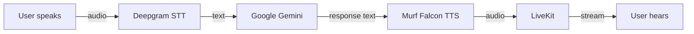

# AI Voice Learning Tutor

A multilingual AI Voice Learning Tutor built with LiveKit, Murf Falcon, Deepgram, and Gemini for the Murf AI VoiceForBharat Challenge 2026.

[](https://murf.ai/)
[](https://murf.ai/)
[](https://murf.ai/)
[](https://opensource.org/licenses/MIT)
[](https://murf.ai/api/docs/text-to-speech/streaming)
[](https://docs.livekit.io)
[](https://www.python.org/)
[](https://nextjs.org/)

**Built by:** Saloni Saini  
**Track:** Learning & Literacy  
**Day 3:** Premium Learning Tutor Experience (Day 1 and Day 2 complete)  
**Powered by:** Murf Falcon

---

## Challenge submission

This repository is a submission for the Murf AI challenge:

> **10 Days of Voice Agents: VoiceForBharat Edition**  
> **Track:** Learning & Literacy  
> **Built by:** Saloni Saini

### Day 1 (completed)

Set up the development environment and run a working starter voice agent end-to-end using **Murf Falcon** for text-to-speech.

### Day 2 (completed)

Transformed the starter into an **AI Voice Learning Tutor** with a structured personality, bilingual conversation support, safety guardrails, a spoken greeting, and a premium Learning & Literacy UI.

### Day 3 (completed)

Built a polished **VoiceForBharat** Learning & Literacy frontend experience: session states, live transcript, voice status indicators, wave visualizer, quick practice suggestions, microphone permission handling, responsive design, and accessibility improvements.

---

## Project overview

**AI Voice Learning Tutor** is a full-stack, real-time voice AI product. Learners speak into the browser; the agent listens, understands, and replies with natural speech. The experience is voice-first: practice starts with a spoken greeting, continues through live conversation, and stays readable with a live transcript and clear session states.

It is built for students and learners across India who want to improve spoken English and everyday communication. The Learning & Literacy focus means the agent acts as a supportive tutor, not a general chatbot, helping with grammar, vocabulary, speaking confidence, and guided practice in a safe, on-topic way.

The project was built for the **Murf AI VoiceForBharat Challenge 2026** to show how modern voice pipelines (LiveKit + Deepgram + Gemini + Murf Falcon) can deliver accessible learning. Learners can speak in **Hindi**, **English**, or natural **Hinglish**, and the tutor mirrors that mix so practice feels familiar and useful.

**Pipeline:**

```text
User speaks → Deepgram STT → Google Gemini → Murf Falcon TTS → LiveKit → User hears
```

LiveKit carries the audio session. The Python backend runs the agent worker. The Next.js frontend provides the talk UI.

Day 1 delivered a working conversational baseline. Day 2 specializes that baseline into a Learning & Literacy tutor. Day 3 turns the frontend into a complete product-style practice experience.

---

## Features

### Feature checklist

- ✅ AI Voice Learning Tutor
- ✅ Live Voice Conversation
- ✅ Murf Falcon TTS
- ✅ Deepgram STT
- ✅ Gemini LLM
- ✅ Hindi Support
- ✅ English Support
- ✅ Hinglish Support
- ✅ Learning Personality
- ✅ Greeting
- ✅ Guardrails
- ✅ Session States
- ✅ Live Transcript
- ✅ Wave Visualizer
- ✅ Premium UI
- ✅ Quick Practice Suggestions
- ✅ Responsive Design
- ✅ Accessibility

### Day 1 baseline

- Real-time voice conversation in the browser
- Murf Falcon TTS with Indian English voice (`Anisha`, `en-IN`)
- Deepgram Nova-3 speech recognition
- Google Gemini responses
- LiveKit Cloud agent dispatch (`my-agent`)
- Next.js UI with microphone controls and chat input
- Local development via backend + frontend (or `start_app.ps1` / `start_app.sh`)

### Day 2 additions

- **AI Voice Learning Tutor** personality for the Learning & Literacy track
- Spoken first-turn **greeting** when a session starts
- **Code-mixed language support** (English, Hindi, and natural Hinglish)
- **Guardrails** that refuse cheating, diagnoses, and out-of-scope advice
- Structured learning **personality** (identity, objectives, knowledge, style)
- **Premium UI** welcome experience with glass cards, badges, and tutor branding

### Day 3 frontend improvements

- **Premium Learning Tutor UI** with Ready / Connecting / Session / Ended states
- **Session state experience** driven by LiveKit connection and agent state
- **Live transcript** always visible during practice
- **Voice status indicators** for Ready, Connecting, Listening, Thinking, Speaking, Ended
- **Wave visualizer** as the main voice feedback element
- **Quick Practice Suggestions** that start a session through the existing LiveKit chat flow
- **Microphone permission handling** with a clear retry path
- **Responsive design** for desktop, tablet, and mobile
- **Accessibility improvements** for status, dialogs, focus, and decorative icons

---

## Tech stack

| Layer | Technology |
| ----- | ---------- |
| Framework | LiveKit Agents |
| Frontend | Next.js, TypeScript, Tailwind CSS |
| Backend | Python (LiveKit Agents SDK, `uv`) |
| LiveKit | Real-time audio transport and agent orchestration |
| Deepgram | Speech-to-text (Nova-3) |
| Gemini | Large language model (Google Gemini) |
| Murf Falcon | Low-latency text-to-speech |
| Tailwind CSS | Utility-first styling |
| TypeScript | Type-safe frontend |
| Next.js | React web app and token API |

Also used: Silero VAD, LiveKit turn detection, `pnpm` (Node).

---

## Challenge progress

| Day | Status | Description |
| --- | ------ | ----------- |
| Day 1 | Completed | Voice agent foundation |
| Day 2 | Completed | Learning Tutor personality |
| Day 3 | Completed | Premium frontend experience |

---

## Screenshots

Add demo images here after recording.

### Ready Screen

_Placeholder: Ready hero, practice suggestions, and Start Talking._

### Conversation

_Placeholder: Live session with wave visualizer and voice status._

### Transcript

_Placeholder: Live transcript during practice._

### Session Ended

_Placeholder: Session ended screen with Practice Again._

---

## Project structure

```text
murf-livekit-starter/
├── backend/                 # Python voice agent
│   ├── src/agent.py         # Pipeline (STT / LLM / TTS) + system prompt
│   ├── tests/               # Agent evaluation tests
│   ├── .env.example         # Backend env template
│   └── pyproject.toml       # Python dependencies (uv)
├── frontend/                # Next.js voice UI
│   ├── app/                 # Pages + LiveKit token API
│   ├── components/          # Agents UI + app shell
│   ├── app-config.ts        # Branding / feature config
│   ├── .env.example         # Frontend env template
│   └── package.json         # Node dependencies (pnpm)
├── start_app.sh             # Start all services (macOS / Linux)
├── start_app.ps1            # Start all services (Windows)
└── README.md                # This file
```

High-level layout:

```text
frontend/
backend/
README.md
```

---

## Prerequisites

- Python **3.10+**
- [uv](https://docs.astral.sh/uv/)
- Node.js **18+**
- [pnpm](https://pnpm.io/)
- A [LiveKit Cloud](https://cloud.livekit.io/) project
- API keys for Murf, Deepgram, and Google Gemini

---

## Installation

### 1. Clone the repository

```bash
git clone <your-repo-url>
cd murf-livekit-starter
```

### 2. Configure environment variables

Copy the example env files and fill in real keys:

```bash
# Backend
cp backend/.env.example backend/.env.local

# Frontend
cp frontend/.env.example frontend/.env.local
```

**Backend (`backend/.env.local`) requires:**

| Variable | Source |
| -------- | ------ |
| `LIVEKIT_URL` | [LiveKit Cloud](https://cloud.livekit.io/) → project Settings |
| `LIVEKIT_API_KEY` | LiveKit Cloud → API Keys |
| `LIVEKIT_API_SECRET` | LiveKit Cloud → API Keys |
| `MURF_API_KEY` | [Murf API Dashboard](https://murf.ai/api/dashboard) |
| `DEEPGRAM_API_KEY` | [Deepgram Console](https://console.deepgram.com/) |
| `GOOGLE_API_KEY` | [Google AI Studio](https://aistudio.google.com/apikey) |

**Frontend (`frontend/.env.local`) requires:**

| Variable | Notes |
| -------- | ----- |
| `LIVEKIT_URL` | Same LiveKit project as backend |
| `LIVEKIT_API_KEY` | Same as backend |
| `LIVEKIT_API_SECRET` | Same as backend |
| `AGENT_NAME` | Set to `my-agent` (matches the backend agent name) |

### 3. Install backend dependencies

```bash
cd backend
uv sync
uv run python src/agent.py download-files
```

### 4. Install frontend dependencies

```bash
cd frontend
pnpm install
```

---

## How to run locally

Use **two terminals** (recommended).

### Terminal 1: Backend

```bash
cd backend
uv run python src/agent.py dev
```

Wait until the logs show the worker registered (for example `registered worker` with `agent_name: my-agent`).

### Terminal 2: Frontend

```bash
cd frontend
pnpm dev
```

Open **http://localhost:3000**, click **Start Talking**, allow microphone access, and speak.

### Windows one-command option

From the repo root:

```powershell
.\start_app.ps1
```

### macOS / Linux one-command option

```bash
chmod +x start_app.sh
./start_app.sh
```

### Backend-only console test (optional)

```bash
cd backend
uv run python src/agent.py console
```

---

## Architecture



---

## Future improvements

- Personalized lessons
- Learning history
- Progress tracking
- Vocabulary challenges
- Pronunciation scoring

---

## Author

Built with ❤️ by **Saloni Saini**

**GitHub:** `https://github.com/<your-username>`

---

## License

This project is licensed under the **MIT License**.

See the original starter license terms: [MIT](https://opensource.org/licenses/MIT).

---

## Acknowledgements

- [Murf AI](https://murf.ai/): Murf Falcon TTS and the VoiceForBharat Challenge
- [LiveKit](https://livekit.io/): Agents SDK and real-time transport
- [Deepgram](https://deepgram.com/): Speech-to-text
- [Google Gemini](https://ai.google.dev/): Large language model
- **VoiceForBharat Challenge**: Murf AI 10 Days of Voice Agents (2026)
- **Powered by Murf Falcon**
