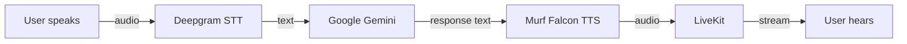

# AI Voice Learning Tutor

A multilingual AI Voice Learning Tutor built with LiveKit, Murf Falcon, Deepgram, and Gemini for the Murf AI VoiceForBharat Challenge 2026.

[](https://murf.ai/)
[](https://murf.ai/)
[](https://murf.ai/)
[](./backend/tests)
[](#)
[](#)
[](https://murf.ai/)
[](https://opensource.org/licenses/MIT)
[](https://murf.ai/api/docs/text-to-speech/streaming)
[](https://docs.livekit.io)
[](https://www.python.org/)
[](https://nextjs.org/)

**Built by:** Saloni Saini  
**Track:** Learning & Literacy  
**Day 7:** Human Help & Intelligent Escalation (Days 1–6 complete)  
**Powered by:** Murf Falcon  
**Status:** Production Ready · Public GitHub Ready · VoiceForBharat Ready · **226 tests passing**

---

## Challenge submission

This repository is a submission for the Murf AI challenge:

> **10 Days of Voice Agents: VoiceForBharat Edition**  
> **Track:** Learning & Literacy  
> **Built by:** Saloni Saini

### Day 1 (completed)

Set up the development environment and run a working starter voice agent end-to-end using **Murf Falcon** for text-to-speech.

### Day 2 (completed)

Transformed the starter into an **AI Voice Learning Tutor** with a structured personality, bilingual conversation support, safety guardrails, a spoken greeting, and a premium Learning & Literacy UI.

### Day 3 (completed)

Built a polished **VoiceForBharat** Learning & Literacy frontend experience: session states, live transcript, voice status indicators, wave visualizer, quick practice suggestions, microphone permission handling, responsive design, and accessibility improvements.

### Day 4 (completed)

Added **persistent SQLite memory**, consent-first storage, returning learner recognition, async background lookup, session memory cache, a **Forget Me** privacy tool, multilingual STT with native-script guidance, and a lightweight **Learning Knowledge Base** searched through LiveKit function tools.

### Day 5 (completed)

Added **Learning & Literacy external tools** with intelligent chaining: exercise lookup (local JSON + optional HTTP provider), rule-based spoken-answer scoring, adaptive follow-up recommendations, topic-aware practice, provider failover/retry/cooldown, session rotation, request cache, validation, tool registry, tool manager, and performance metrics — all via LiveKit function tools without changing the voice pipeline.

### Day 6 (completed)

Added **outbound telephony** for the Learning Tutor: typed telephony configuration, call preparation and LiveKit SIP outbound placement, deterministic conversation bootstrap (English + Hindi Devanagari), daily-practice coordinator reusing Day 5 memory/exercise tools, outbound speaking evaluation with recommendations, and structured call-outcome handling — without changing the browser voice pipeline or frontend.

### Day 7 (completed)

Added **human-help escalation** for the Learning Tutor: consent-first escalation requests, reference IDs, Discord/webhook human notification with graceful failure, urgency levels, PII sanitization, duplicate detection, status tracking (`open` → `in_progress` → `resolved`), and optional outbound resolution callbacks that reuse Day 6 `TelephonyService` — without changing the browser voice pipeline, memory, knowledge, or database schema.

---

## Project overview

**AI Voice Learning Tutor** is a full-stack, real-time voice AI product. Learners speak into the browser; the agent listens, understands, and replies with natural speech. The experience is voice-first: practice starts with a spoken greeting, continues through live conversation, and stays readable with a live transcript and clear session states.

It is built for students and learners across India who want to improve spoken English and everyday communication. The Learning & Literacy focus means the agent acts as a supportive tutor, not a general chatbot, helping with grammar, vocabulary, speaking confidence, and guided practice in a safe, on-topic way.

The project was built for the **Murf AI VoiceForBharat Challenge 2026** to show how modern voice pipelines (LiveKit + Deepgram + Gemini + Murf Falcon) can deliver accessible learning. Learners can speak in **Hindi**, **English**, or natural **Hinglish**, and the tutor mirrors that mix so practice feels familiar and useful.

**Pipeline:**

```text
User speaks → Deepgram STT → Google Gemini → Murf Falcon TTS → LiveKit → User hears
```

LiveKit carries the audio session. The Python backend runs the agent worker. The Next.js frontend provides the talk UI.

Day 1 delivered a working conversational baseline. Day 2 specializes that baseline into a Learning & Literacy tutor. Day 3 turns the frontend into a complete product-style practice experience. Day 4 adds persistent memory, privacy controls, and a function-based learning knowledge base. Day 5 adds external learning tools, provider failover, and intelligent tool chaining. Day 6 adds outbound telephony so the tutor can call learners for daily speaking practice. Day 7 adds consent-first human-help escalation with safe notification delivery and optional resolution callbacks.

---

## Features

### Feature checklist

- ✅ AI Voice Learning Tutor
- ✅ Live Voice Conversation
- ✅ Murf Falcon TTS
- ✅ Deepgram STT
- ✅ Gemini LLM
- ✅ Hindi Support
- ✅ English Support
- ✅ Hinglish Support
- ✅ Learning Personality
- ✅ Greeting
- ✅ Guardrails
- ✅ Session States
- ✅ Live Transcript
- ✅ Wave Visualizer
- ✅ Premium UI
- ✅ Quick Practice Suggestions
- ✅ Responsive Design
- ✅ Accessibility
- ✅ Persistent Memory
- ✅ SQLite Memory
- ✅ Consent-Based Memory
- ✅ Returning Learners
- ✅ Async Background Lookup
- ✅ Session Memory Cache
- ✅ Forget Me Tool
- ✅ Consent-First Storage
- ✅ Learning Knowledge Base
- ✅ Function-Based Knowledge Search
- ✅ JSON Repository
- ✅ Exercise Lookup Tool
- ✅ Rule-Based Scoring
- ✅ Adaptive Practice Recommendation
- ✅ Topic-Aware Exercises
- ✅ External Exercise Provider
- ✅ Local Dataset Fallback
- ✅ Retry Strategy
- ✅ Provider Health Cache
- ✅ Request Cache
- ✅ Session Exercise Rotation
- ✅ Tool Validation
- ✅ Tool Registry
- ✅ Tool Manager
- ✅ Tool Metrics
- ✅ Telephony Configuration
- ✅ Outbound Call Service
- ✅ LiveKit Telephony Integration
- ✅ Conversation Bootstrap
- ✅ Daily Practice Coordinator
- ✅ Outbound Learning Session
- ✅ Call Outcome Handling
- ✅ Telephony Metrics & Diagnostics
- ✅ Runtime Feature Flags
- ✅ Production Readiness Report
- ✅ Human-Help Escalation
- ✅ Consent-First Escalation
- ✅ Discord / Webhook Notification
- ✅ Escalation Reference IDs
- ✅ Urgency Levels
- ✅ PII / Sensitive-Data Sanitization
- ✅ Duplicate Escalation Detection
- ✅ Escalation Status Tracking
- ✅ Resolution Callback Preparation

### Core capabilities

| Area | What ships |
| ---- | ---------- |
| **LiveKit Voice Agent** | Real-time browser voice session with agent dispatch (`my-agent`) |
| **Murf Falcon** | Low-latency TTS (`Anisha`, conversational style) |
| **Persistent Memory** | Consent-first SQLite learner profiles + Forget Me |
| **Knowledge Repository** | JSON learning tips via `search_learning_knowledge` |
| **External Exercise Provider** | Optional HTTP exercises with local JSON fallback |
| **Tool Registry** | Dev-facing capability discovery for learning tools |
| **Tool Manager** | Internal validated execution pipeline + metrics |
| **Validation Layer** | Structured tool response sanitization |
| **Telephony** | Typed config, health, diagnostics, feature flags |
| **Outbound Calling** | LiveKit SIP outbound placement with structured errors |
| **Conversation Bootstrap** | Deterministic EN / Hindi (Devanagari) call intro |
| **Daily Practice Coordinator** | Memory lookup → exercise preparation |
| **Speaking Evaluation** | Score → recommend → optional follow-up exercise |
| **Call Outcome Handling** | Answered / busy / no-answer / voicemail / rejected / failed |
| **Human-Help Escalation** | Consent-first requests with reference IDs + webhook notify |
| **Escalation Safety** | Urgency, PII sanitization, duplicate detection, status tracking |
| **Resolution Callback** | Explicit-consent prepare path reusing Day 6 telephony |

### Day 1 baseline

- Real-time voice conversation in the browser
- Murf Falcon TTS with Indian English voice (`Anisha`, `en-IN`)
- Deepgram Nova-3 speech recognition
- Google Gemini responses
- LiveKit Cloud agent dispatch (`my-agent`)
- Next.js UI with microphone controls and chat input
- Local development via backend + frontend (or `start_app.ps1` / `start_app.sh`)

### Day 2 additions

- **AI Voice Learning Tutor** personality for the Learning & Literacy track
- Spoken first-turn **greeting** when a session starts
- **Code-mixed language support** (English, Hindi, and natural Hinglish)
- **Guardrails** that refuse cheating, diagnoses, and out-of-scope advice
- Structured learning **personality** (identity, objectives, knowledge, style)
- **Premium UI** welcome experience with glass cards, badges, and tutor branding

### Day 3 frontend improvements

- **Premium Learning Tutor UI** with Ready / Connecting / Session / Ended states
- **Session state experience** driven by LiveKit connection and agent state
- **Live transcript** always visible during practice
- **Voice status indicators** for Ready, Connecting, Listening, Thinking, Speaking, Ended
- **Wave visualizer** as the main voice feedback element
- **Quick Practice Suggestions** that start a session through the existing LiveKit chat flow
- **Microphone permission handling** with a clear retry path
- **Responsive design** for desktop, tablet, and mobile
- **Accessibility improvements** for status, dialogs, focus, and decorative icons

### Day 4 persistent memory and knowledge

#### Persistent Memory

- **SQLite Memory** stored in `backend/data/memory.db`
- **Consent-Based Memory** before anything is saved
- **Returning Learners** recognized through lookup tools
- **Async Background Lookup** during session startup
- **Session Memory Cache** so lookup runs once per conversation

#### Privacy

- **Forget Me Tool** for permanent profile deletion by voice
- **Consent-First Storage** with no save when the learner declines

#### Knowledge

- **Learning Knowledge Base** for greetings, grammar, pronunciation, vocabulary, and confidence tips
- **Function-Based Knowledge Search** via LiveKit tool `search_learning_knowledge`
- **JSON Repository** loaded from `backend/src/knowledge/resources/english_basics.json`

#### Backend Improvements

- **Typed Models** for learner profiles
- **Repository Pattern** for database-only access
- **LiveKit Function Tools** for memory and knowledge
- **Async Lookup** with cached session results
- **Modular Architecture** (`memory/`, `knowledge/`)

### Day 5 Completed

#### Learning Tools

- **Exercise Lookup Tool** (`get_next_exercise`) with optional topic filter
- **Rule-Based Scoring** (`score_spoken_answer`) — deterministic, no LLM scoring
- **Adaptive Practice Recommendation** (`recommend_next_practice`)
- **LiveKit Function Tools** registered beside memory and knowledge tools

#### Tool Architecture

- **External Provider** (optional HTTP API via `EXERCISE_SOURCE=api`)
- **Local Dataset Fallback** (`backend/src/tools/resources/exercises.json`)
- **Retry Strategy** for transient provider failures
- **Provider Health Cache** with configurable cooldown
- **Request Cache** for identical exercise requests (TTL)
- **Session Exercise Rotation** to avoid repeats in one conversation
- **Tool Validation** and response sanitization
- **Tool Registry** for capability discovery (dev-only)
- **Tool Manager** centralized execution pipeline (internal)
- **Tool Metrics** in-memory timing and success/failure counts

#### Production Improvements

- Deterministic scoring
- Modular repositories
- Provider failover
- Session-only caching
- Metrics
- Validation
- Dependency injection
- Robust logging

### Day 6 Completed

#### Outbound Telephony

- **Telephony Configuration** — cached LiveKit/Twilio/SIP settings
- **Outbound Call Service** — prepare and place structured outbound calls
- **LiveKit Telephony Integration** — SIP participant outbound dialing
- **Conversation Bootstrap** — deterministic intro with stop instruction
- **Daily Practice Coordinator** — memory lookup → exercise preparation
- **Outbound Learning Session** — score → recommend → optional follow-up
- **Call Outcome Handling** — answered/busy/no-answer/voicemail/rejected/failed

#### Production Improvements

- Typed Telephony Configuration
- Structured Validation
- Dependency Injection
- Reusable Telephony Services
- Safe Logging
- Deterministic Bootstrap
- Structured Errors

#### Bonus Features

- **Telephony Metrics** — in-memory operational counters
- **Operational Counters** — calls, bootstrap, learning, evaluation, outcomes
- **In-memory Metrics Snapshot** — `get_metrics()` / health metrics block
- **Lightweight Observability** — audit lifecycle events (no persistence)
- **Outbound Call Audit Logger** — structured `Audit event:` logs
- **Runtime Feature Flags** — telephony / outbound / bootstrap / learning / evaluation / metrics / audit / diagnostics toggles
- **Production Readiness** — end-to-end readiness verification
- **Aggregated health report** — configuration, provider, metrics, feature flags
- **Safe operational checks** — no secrets or SDK objects exposed
- **Structured production summary** — `generate_readiness_report()`

#### Production Diagnostics

- Startup self-check
- Configuration verification
- Provider readiness
- Metrics verification
- Structured health reporting

---

## Tech stack

| Layer | Technology |
| ----- | ---------- |
| Framework | LiveKit Agents |
| Frontend | Next.js, TypeScript, Tailwind CSS |
| Backend | Python (LiveKit Agents SDK, `uv`) |
| LiveKit | Real-time audio transport and agent orchestration |
| Deepgram | Speech-to-text (Nova-3) |
| Gemini | Large language model (Google Gemini) |
| Murf Falcon | Low-latency text-to-speech |
| Tailwind CSS | Utility-first styling |
| TypeScript | Type-safe frontend |
| Next.js | React web app and token API |

Also used: Silero VAD, LiveKit turn detection, `pnpm` (Node).

---

## VoiceForBharat Challenge Progress

| Day | Status | Description |
| --- | ------ | ----------- |
| Day 1 | ✅ Completed | Voice Agent Foundation |
| Day 2 | ✅ Completed | AI Learning Tutor |
| Day 3 | ✅ Completed | Premium Frontend Experience |
| Day 4 | ✅ Completed | Persistent Memory & Knowledge |
| Day 5 | ✅ Completed | External Learning Tools & Intelligent Tool Chaining |
| Day 6 | ✅ Completed | Outbound Calling & Telephony |
| Day 7 | ✅ Completed | Human Help & Intelligent Escalation |

**Submission status:** Day 7 complete · Production Ready · Public GitHub Ready · VoiceForBharat Ready

---

## Screenshots

Add demo images here after recording.

### Ready Screen

_Placeholder: Ready hero, practice suggestions, and Start Talking._

### Conversation

_Placeholder: Live session with wave visualizer and voice status._

### Transcript

_Placeholder: Live transcript during practice._

### Session Ended

_Placeholder: Session ended screen with Practice Again._

---

## Project structure

```text
Amurf-livekit-starter/
├── backend/                      # Python voice agent (LiveKit Agents + uv)
│   ├── src/agent.py              # Pipeline (STT / LLM / TTS) + system prompt
│   ├── src/memory/               # SQLite memory models, repository, tools
│   ├── src/knowledge/            # JSON knowledge base, search, tools
│   ├── src/tools/                # Learning tools, provider, registry, manager
│   │   └── resources/exercises.json
│   ├── src/telephony/            # Outbound calling, bootstrap, metrics, flags
│   ├── src/escalation/           # Human-help escalation, notify, status, callback
│   ├── data/                     # Local SQLite db (gitignored *.db)
│   ├── tests/                    # Day 1–7 + bonus tests (226 passing)
│   ├── .env.example              # Backend env template (placeholders only)
│   └── pyproject.toml            # Python dependencies (uv)
├── frontend/                     # Next.js voice UI
│   ├── app/                      # Pages + LiveKit token API
│   ├── components/               # Agents UI + app shell
│   ├── app-config.ts             # Branding / feature config
│   ├── .env.example              # Frontend env template
│   └── package.json              # Node dependencies (pnpm)
├── start_app.sh                  # Start all services (macOS / Linux)
├── start_app.ps1                 # Start all services (Windows)
├── AGENTS.md                     # Contributor / agent notes
└── README.md                     # This file
```

---

## Prerequisites

- Python **3.10+**
- [uv](https://docs.astral.sh/uv/)
- Node.js **18+**
- [pnpm](https://pnpm.io/)
- A [LiveKit Cloud](https://cloud.livekit.io/) project
- API keys for Murf, Deepgram, and Google Gemini

---

## Installation

### 1. Clone the repository

```bash
git clone <your-repo-url>
cd Amurf-livekit-starter
```

### 2. Configure environment variables

Copy the example env files and fill in real keys:

```bash
# Backend
cp backend/.env.example backend/.env.local

# Frontend
cp frontend/.env.example frontend/.env.local
```

**Backend (`backend/.env.local`) requires:**

| Variable | Source |
| -------- | ------ |
| `LIVEKIT_URL` | [LiveKit Cloud](https://cloud.livekit.io/) → project Settings |
| `LIVEKIT_API_KEY` | LiveKit Cloud → API Keys |
| `LIVEKIT_API_SECRET` | LiveKit Cloud → API Keys |
| `MURF_API_KEY` | [Murf API Dashboard](https://murf.ai/api/dashboard) |
| `DEEPGRAM_API_KEY` | [Deepgram Console](https://console.deepgram.com/) |
| `GOOGLE_API_KEY` | [Google AI Studio](https://aistudio.google.com/apikey) |

**Frontend (`frontend/.env.local`) requires:**

| Variable | Notes |
| -------- | ----- |
| `LIVEKIT_URL` | Same LiveKit project as backend |
| `LIVEKIT_API_KEY` | Same as backend |
| `LIVEKIT_API_SECRET` | Same as backend |
| `AGENT_NAME` | Set to `my-agent` (matches the backend agent name) |

**Optional backend telephony (Day 6)** — placeholders in `backend/.env.example`:

| Variable | Notes |
| -------- | ----- |
| `LIVEKIT_SIP_OUTBOUND_TRUNK_ID` | LiveKit SIP outbound trunk id |
| `TWILIO_ACCOUNT_SID` / `TWILIO_AUTH_TOKEN` / `TWILIO_PHONE_NUMBER` | Optional provider credentials |
| `OUTBOUND_CALLER_NAME` | Defaults to `VoiceForBharat Tutor` |
| `DEFAULT_COUNTRY_CODE` | Defaults to `+91` |
| `TELEPHONY_ENABLED`, `OUTBOUND_CALLING_ENABLED`, … | Feature flags (default `true`) |

Optional Day 5 exercise provider: `EXERCISE_SOURCE`, `EXERCISE_API_URL`, and related timeout/retry vars (see `.env.example`).

**Optional human-help webhook (Day 7)** — placeholder in `backend/.env.example`:

| Variable | Notes |
| -------- | ----- |
| `ESCALATION_WEBHOOK_URL` | Discord (or compatible) webhook for human-help notifications; leave empty for local use |

### 3. Install backend dependencies

```bash
cd backend
uv sync
uv run python src/agent.py download-files
```

### 4. Install frontend dependencies

```bash
cd frontend
pnpm install
```

---

## How to run locally

Use **two terminals** (recommended).

### Terminal 1: Backend

```bash
cd backend
uv run python src/agent.py dev
```

Wait until the logs show the worker registered (for example `registered worker` with `agent_name: my-agent`).

### Terminal 2: Frontend

```bash
cd frontend
pnpm dev
```

Open **http://localhost:3000**, click **Start Talking**, allow microphone access, and speak.

### Windows one-command option

From the repo root:

```powershell
.\start_app.ps1
```

### macOS / Linux one-command option

```bash
chmod +x start_app.sh
./start_app.sh
```

### Backend-only console test (optional)

```bash
cd backend
uv run python src/agent.py console
```

---

## Testing

From `backend/`:

```bash
cd backend
uv run pytest
```

Requires LiveKit credentials for agent evaluation tests. Current suite: **226 tests passing** (Days 1–7 + escalation bonuses).

Also useful:

```bash
uv run ruff check .
uv run ruff format .
```

Frontend:

```bash
cd frontend
pnpm lint
```

---

## Architecture



Outbound telephony (Day 6) is a separate backend path:

```text
TelephonyService → prepare_call → LiveKit SIP dial
                 → bootstrap → daily practice → evaluate → call outcome
```

Browser voice sessions and Murf Falcon TTS remain unchanged.

---

## Day 5 demo checklist

1. **New learner** — consent → memory saved  
2. **Returning learner** — personalized greeting + saved level reused  
3. **"Give me an exercise."** — exercise tool fires naturally  
4. **Spoken answer scoring** — score → recommendation → follow-up exercise  
5. **Knowledge lookup** — grammar / pronunciation / vocabulary tip  
6. **Forget Me** — profile removed; restart shows no learner  
7. **API failure** — `EXERCISE_SOURCE=api` with forced failure → local fallback, no interruption  

---

## Day 6 demo checklist

1. **Telephony health** — configuration loads, service reports ready  
2. **Outbound call initiated** — prepare → LiveKit dial → structured `calling` response  
3. **Bootstrap introduction** — identity + reason + stop instruction (EN / Hindi Devanagari)  
4. **Daily practice exercise** — lookup level → `get_next_exercise` → ready state  
5. **Spoken answer evaluation** — score → recommendation → follow-up exercise  
6. **Call outcome handling** — answered/busy/no-answer/voicemail/rejected/failed  
7. **LiveKit failure fallback** — structured `Unable to place outbound call.` (no stack traces)  

---

# Day 7 — Human Help & Escalation

## Core

- Human-help escalation
- Consent-first escalation
- Reference IDs
- Real human-help notification
- Graceful notification failure

## Bonus Improvements

- Urgency levels
- PII / sensitive-data sanitization
- Duplicate escalation detection
- Escalation status tracking
- Outbound callback after resolution

## Safety

- Explicit consent before escalation
- Explicit callback consent
- No automatic callbacks
- Sensitive information removed before notification
- No secrets or transcripts exposed

## Production Readiness

- Structured errors
- Deterministic status transitions
- Safe logging
- Existing Day 6 telephony reused
- Existing LiveKit tool architecture preserved

## Testing

Full backend suite: **226 passed** (`pytest -q`)

## Day 7 Demo Checklist

1. Normal conversation — no escalation
2. Learner requests teacher help
3. Consent prompt
4. Escalation created
5. Reference ID shown
6. Human notification shown
7. Duplicate request handled
8. Escalation status updated
9. Escalation resolved
10. Callback consent requested
11. Callback prepared
12. Hindi/native-script behavior verified

---

## Future improvements

- Personalized lessons
- Learning history
- Progress tracking
- Vocabulary challenges
- Pronunciation scoring

---

## Author

Built with ❤️ by **Saloni Saini**

**GitHub:** `https://github.com/<your-username>`

---

## License

This project is licensed under the **MIT License**.

See the original starter license terms: [MIT](https://opensource.org/licenses/MIT).

---

## Acknowledgements

- [Murf AI](https://murf.ai/): Murf Falcon TTS and the VoiceForBharat Challenge
- [LiveKit](https://livekit.io/): Agents SDK and real-time transport
- [Deepgram](https://deepgram.com/): Speech-to-text
- [Google Gemini](https://ai.google.dev/): Large language model
- **VoiceForBharat Challenge**: Murf AI 10 Days of Voice Agents (2026)
- **Powered by Murf Falcon**
