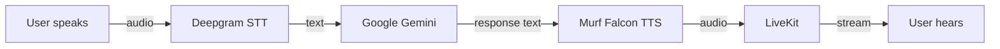

# VoiceForBharat - AI Voice Learning Tutor

Real-time AI voice agent built for the **Murf AI 10 Days of Voice Agents - VoiceForBharat Edition**.

**Built by:** Saloni Saini  
**Track:** Learning & Literacy  
**Day:** 2 - AI Voice Learning Tutor (Day 1 complete)

[](https://opensource.org/licenses/MIT)
[](https://murf.ai/api/docs/text-to-speech/streaming)
[](https://docs.livekit.io)
[](https://www.python.org/)
[](https://nextjs.org/)

---

## Challenge submission

This repository is my submission for the Murf AI challenge:

> **10 Days of Voice Agents - VoiceForBharat Edition**  
> **Track:** Learning & Literacy  
> **Built by:** Saloni Saini

### Day 1 (completed)

Set up the development environment and run a working starter voice agent end-to-end using **Murf Falcon** for text-to-speech.

### Day 2 (completed)

Transformed the starter into an **AI Voice Learning Tutor** with a structured personality, bilingual conversation support, safety guardrails, a spoken greeting, and a premium Learning & Literacy UI.

---

## Project overview

This project is a full-stack real-time voice AI agent. You speak into the browser; the agent listens, understands, and replies with natural speech.

**Pipeline:**

```text
User speaks → Deepgram STT → Google Gemini → Murf Falcon TTS → LiveKit → User hears
```

LiveKit carries the audio session. The Python backend runs the agent worker. The Next.js frontend provides the talk UI.

Day 1 delivered a working conversational baseline. Day 2 specializes that baseline into a Learning & Literacy tutor that can practice spoken English in Hindi, English, or Hinglish.

---

## Technologies used

| Technology | Role |
| ---------- | ---- |
| **LiveKit** | Real-time audio transport and agent orchestration |
| **Murf Falcon TTS** | Low-latency text-to-speech |
| **Deepgram STT** | Speech-to-text (Nova-3) |
| **Google Gemini** | Large language model |
| **Python** | Backend agent (LiveKit Agents SDK) |
| **Next.js** | Frontend web app |
| **TypeScript** | Frontend type-safe UI |

Also used: Silero VAD, LiveKit turn detection, `uv` (Python), `pnpm` (Node).

---

## Features

### Day 1 baseline

- Real-time voice conversation in the browser
- Murf Falcon TTS with Indian English voice (`Anisha`, `en-IN`)
- Deepgram Nova-3 speech recognition
- Google Gemini responses
- LiveKit Cloud agent dispatch (`my-agent`)
- Next.js UI with microphone controls and chat input
- Local development via backend + frontend (or `start_app.ps1` / `start_app.sh`)

### Day 2 additions

- **AI Voice Learning Tutor** personality for the Learning & Literacy track
- Spoken first-turn **greeting** when a session starts
- **Code-mixed language support** (English, Hindi, and natural Hinglish)
- **Guardrails** that refuse cheating, diagnoses, and out-of-scope advice
- Structured learning **personality** (identity, objectives, knowledge, style)
- **Premium UI** welcome experience with glass cards, badges, and tutor branding

---

## Project structure

```text
murf-livekit-starter/
├── backend/                 # Python voice agent
│   ├── src/agent.py         # Pipeline (STT / LLM / TTS) + system prompt
│   ├── tests/               # Agent evaluation tests
│   ├── .env.example         # Backend env template
│   └── pyproject.toml       # Python dependencies (uv)
├── frontend/                # Next.js voice UI
│   ├── app/                 # Pages + LiveKit token API
│   ├── components/          # Agents UI + app shell
│   ├── app-config.ts        # Branding / feature config
│   ├── .env.example         # Frontend env template
│   └── package.json         # Node dependencies (pnpm)
├── start_app.sh             # Start all services (macOS / Linux)
├── start_app.ps1            # Start all services (Windows)
└── README.md                # This file
```

---

## Prerequisites

- Python **3.10+**
- [uv](https://docs.astral.sh/uv/)
- Node.js **18+**
- [pnpm](https://pnpm.io/)
- A [LiveKit Cloud](https://cloud.livekit.io/) project
- API keys for Murf, Deepgram, and Google Gemini

---

## Installation

### 1. Clone the repository

```bash
git clone <your-repo-url>
cd murf-livekit-starter
```

### 2. Configure environment variables

Copy the example env files and fill in real keys:

```bash
# Backend
cp backend/.env.example backend/.env.local

# Frontend
cp frontend/.env.example frontend/.env.local
```

**Backend (`backend/.env.local`) requires:**

| Variable | Source |
| -------- | ------ |
| `LIVEKIT_URL` | [LiveKit Cloud](https://cloud.livekit.io/) → project Settings |
| `LIVEKIT_API_KEY` | LiveKit Cloud → API Keys |
| `LIVEKIT_API_SECRET` | LiveKit Cloud → API Keys |
| `MURF_API_KEY` | [Murf API Dashboard](https://murf.ai/api/dashboard) |
| `DEEPGRAM_API_KEY` | [Deepgram Console](https://console.deepgram.com/) |
| `GOOGLE_API_KEY` | [Google AI Studio](https://aistudio.google.com/apikey) |

**Frontend (`frontend/.env.local`) requires:**

| Variable | Notes |
| -------- | ----- |
| `LIVEKIT_URL` | Same LiveKit project as backend |
| `LIVEKIT_API_KEY` | Same as backend |
| `LIVEKIT_API_SECRET` | Same as backend |
| `AGENT_NAME` | Set to `my-agent` (matches the backend agent name) |

### 3. Install backend dependencies

```bash
cd backend
uv sync
uv run python src/agent.py download-files
```

### 4. Install frontend dependencies

```bash
cd frontend
pnpm install
```

---

## How to run locally

Use **two terminals** (recommended):

**Terminal 1 - Backend**

```bash
cd backend
uv run python src/agent.py dev
```

Wait until the logs show the worker registered (for example `registered worker` with `agent_name: my-agent`).

**Terminal 2 - Frontend**

```bash
cd frontend
pnpm dev
```

Open **http://localhost:3000**, click **Start talking**, allow microphone access, and speak.

### Windows one-command option

From the repo root:

```powershell
.\start_app.ps1
```

### macOS / Linux one-command option

```bash
chmod +x start_app.sh
./start_app.sh
```

### Backend-only console test (optional)

```bash
cd backend
uv run python src/agent.py console
```

---

## Architecture



---

## License

This project is licensed under the **MIT License**.

See the original starter license terms: [MIT](https://opensource.org/licenses/MIT).

---

## Acknowledgements

- [Murf AI](https://murf.ai/) - Murf Falcon TTS & VoiceForBharat challenge
- [LiveKit](https://livekit.io/) - Agents SDK & real-time transport
- [Deepgram](https://deepgram.com/) - Speech-to-text
- [Google Gemini](https://ai.google.dev/) - LLM
