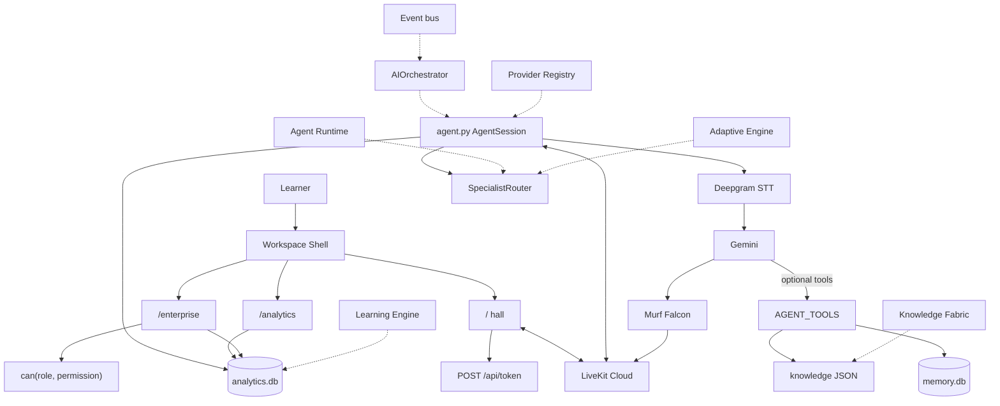

# SALORA OS

A voice-first learning product. A learner opens a browser, speaks, and a LiveKit worker answers with Murf Falcon. One Voice Pipeline. No second mouth.

**Status:** architecture frozen (`v1.0.0-rc`). Spoken identity: AI Voice Learning Tutor. Chrome: SALORA OS.

| Implemented | Architected | Planned |
| --- | --- | --- |
| Hall voice, memory, tools, math guest, `/analytics`, `/enterprise` | Orchestrator, Search, Automation, Fabric, Runtime host, Studio models | Identity + `AUTH_REQUIRED=true`, OTel, job queue, plugin signing |

Docs: [docs/README.md](docs/README.md)

---

## 1. Overview

The home route is a hall, not a dashboard with a microphone. You join a LiveKit room. A Python worker named `my-agent` joins the same room. Deepgram hears. Gemini writes a short reply. Murf Falcon (`Anisha`) speaks it.

Memory, if you allow it, is a consented profile in `memory.db`. Call stats live in `analytics.db`. Those files are not joined by identity. Dashboards never store what you said.

If you read one source file, read [`backend/src/agent.py`](backend/src/agent.py).

---

## 2. Problem

Most learning software asks you to type. Speaking English (or mixing Hindi and English) is a different skill. Products that “support Hindi” with a dropdown are not the same as a tutor that hears a mixed sentence and answers in kind.

Voice products also like to keep tapes. This one does not. The analytics schema has outcomes and timings. It does not have an utterance column. CI fails the other way.

---

## 3. Target users

| Who | What exists today |
| --- | --- |
| Learners | Hall, greeting, practice, score, Forget Me |
| Teachers | Escalation path and aggregates. No `/teacher` page |
| Parents | Named in product law. No `/parent` route |
| Organizations | `/enterprise`. Later tenant records are in-memory |
| Developers | `uv` + `pnpm`, function tools, one router. No portal UI |

---

## 4. Voice AI experience

Click **Enter the hall**. Allow the microphone. Speak in English, Hindi, or Hinglish. Hindi in the reply is Devanagari, not default Roman. Chat input is on (`supportsChatInput: true`). Voice is the practice.

Session screens: welcome, connecting, listening / thinking / speaking, ended, mic-permission retry. A wave shows the turn.

---

## 5. Murf Falcon

Only TTS constructor in the worker: `murf.TTS(voice="Anisha", style="Conversation", text_pacing=False)`. Specialists reuse that mouth. There is no backup TTS.

Latency: knobs exist (see Voice pipeline). **Not benchmarked in this validation run.** No millisecond number is published from this repository.

---

## 6. LiveKit

Transport is LiveKit Cloud. The browser and the worker do not stream audio to each other. Next.js mints a room JWT (`POST /api/token`). Agent dispatch name: `my-agent`.

---

## 7. AI architecture

Gemini 3.5 Flash Lite is the only model that produces the spoken line. It may call `AGENT_TOOLS`. The prompt forbids tool chatter, shame, exam cheating, and medical / legal / financial diagnosis.

`AIOrchestrator` is a **facade**. It is not invoked from `my_agent`. Do not draw “speech → orchestrator → Murf.”

---

## 8. Agent Runtime

`AgentRuntimeService` hosts the tutor manifest and registered guests. `may_autonomous_loop` is false. Math is the only live guest. The runtime does not replace `AgentSession`.

---

## 9. Learning intelligence

Hall tools: `get_next_exercise`, `score_spoken_answer` (deterministic), `recommend_next_practice` (conversation only). Scores are not written onto `User`.

The Learning Engine on the frontend **projects** analytics and memory. It does not teach and does not generate speech.

---

## 10. Adaptive learning

The Adaptive Engine **advises**. `SpecialistRouter` still decides math versus host. One retry, then fail toward the host.

---

## 11. Knowledge Fabric

Hall retrieval is `search_learning_knowledge` over `backend/src/knowledge/resources/english_basics.json`. Fabric and Memory Graph are semantic projections of that search. They must not write `memory.db`.

---

## 12. Backend platform

`salora_platform`: typed config, optional auth, `can(role, permission)`, health, redacting logs. Worker health: `uv run python -m salora_platform.health`.

Domain packages stay next to the worker: `memory/`, `knowledge/`, `tools/`, `specialists/`, `escalation/`, `telephony/`, `analytics/`, `enterprise/`.

---

## 13. Enterprise platform

`/enterprise` is a Control Center over operational aggregates. Speech columns are forbidden. `AUTH_REQUIRED` defaults **false** so anonymous voice works. HIPAA checks return `ok: False`. Marketplace `may_execute` is false.

---

## 14. Developer platform

HTTP: token, health, ready, analytics, enterprise export. SDK envelopes (`ApiEnvelope` v1) are **architected**. `portal_ui` is false. Add a tool on `Assistant` with `@function_tool`. Do not add a second pipeline.

---

## 15. Search and automation

`SearchService` / `DiscoveryService` (alias) fan out to knowledge, catalog, and agent manifests. One `SearchHit` contract. No vector database in Compose.

`AutomationService` is the only workflow engine (`WorkflowAutomationService` is the same class). Jobs are a catalog, not Kafka.

Learners do not get a search box on `/`.

---

## 16. System architecture

Facades (orchestrator, runtime, search, automation, fabric) wrap the worker. They are not in the audio hop.



Dashed edges are facades and projections. Solid edges are the live path. Full maps: [docs/architecture/diagrams.md](docs/architecture/diagrams.md).

---

## 17. Voice pipeline

```text
Microphone → LiveKit → Deepgram nova-3 (language=multi)
  → Gemini 3.5 Flash Lite (tools allowed)
  → Murf Falcon Anisha (text_pacing=False)
  → LiveKit → Speaker
```

Knobs in `agent.py`: `max_output_tokens=120`, `thinking_level=minimal`, endpointing 0.3–1.5s, `preemptive_generation=True`, Silero VAD prewarm.

Telephony is a **separate** SIP path. It does not replace the browser session.

**Not benchmarked in this validation run.**

---

## 18. Technology stack

| Layer | Technology |
| --- | --- |
| Transport | LiveKit Agents ~1.4 |
| TTS | Murf Falcon (`livekit-murf`) |
| STT | Deepgram Nova-3 |
| LLM | Google Gemini |
| VAD / turns | Silero + LiveKit turn detector |
| Backend | Python 3.10+, uv |
| Frontend | Next.js 15, React 19, TypeScript, Tailwind, pnpm |
| Stores | SQLite (`memory.db`, `analytics.db`), knowledge JSON |

---

## 19. Repository structure

```text
├── backend/                 # LiveKit worker
│   ├── src/agent.py         # Voice Pipeline
│   ├── src/memory/          # Consented profiles
│   ├── src/knowledge/       # JSON lessons
│   ├── src/specialists/     # SpecialistRouter
│   ├── src/services/        # Facades (do not replace the worker)
│   ├── src/salora_platform/ # Auth, RBAC, health
│   └── tests/
├── frontend/                # Next.js hall + instruments
│   ├── app/                 # /, /analytics, /enterprise, API
│   ├── components/os/       # Workspace Shell
│   └── lib/                 # Engines and platform
├── docs/                    # Public documentation
├── scripts/                 # ci.sh / ci.ps1
├── docker-compose.yml
├── start_app.ps1 / start_app.sh
├── CONTRIBUTING.md
├── CHANGELOG.md
└── AGENTS.md
```

---

## 20. Installation

Prerequisites: Python 3.10+, [uv](https://docs.astral.sh/uv/), Node 18+, [pnpm](https://pnpm.io/), a [LiveKit Cloud](https://cloud.livekit.io/) project, API keys for Murf, Deepgram, and Gemini.

```bash
git clone https://github.com/SAutopsYS/SALORA-OS.git
cd SALORA-OS
cp backend/.env.example backend/.env.local
cp frontend/.env.example frontend/.env.local
```

Fill keys. Full guide: [docs/guides/installation.md](docs/guides/installation.md).

---

## 21. Environment configuration

Required on **both** sides: `LIVEKIT_URL`, `LIVEKIT_API_KEY`, `LIVEKIT_API_SECRET`.

Required on the backend only: `MURF_API_KEY`, `DEEPGRAM_API_KEY`, `GOOGLE_API_KEY`.

Optional frontend: `AGENT_NAME=my-agent`.

`AUTH_REQUIRED` defaults to `false`. Table: [docs/guides/configuration.md](docs/guides/configuration.md).

---

## 22. API key safety

- Copy examples to `.env.local`. Never commit `.env.local`.
- `.env` and `.env.*` are gitignored except `*.env.example`.
- Examples contain placeholders only (`your_livekit_api_key`).
- Do not paste live keys into docs, issues, or screenshots.

---

## 23. Running the backend

```bash
cd backend
uv sync
uv run python src/agent.py download-files
uv run python src/agent.py dev
```

Wait for `registered worker` and `agent_name: my-agent`. Production process: `start`. Console (no UI): `console`.

---

## 24. Running the frontend

```bash
cd frontend
pnpm install
pnpm dev
```

Open http://localhost:3000.

Windows: `.\start_app.ps1`. Unix: `./start_app.sh`. Compose: `docker compose up --build`.

---

## 25. Running the voice agent

1. Worker registered (`my-agent`).
2. Hall open. Click **Enter the hall**.
3. Allow the microphone.
4. Speak. You should hear Murf Falcon.

`GET /api/ready` is 200 when LiveKit env is present.

---

## 26. Testing

```bash
cd backend
uv run python -m pytest -q --ignore=tests/test_agent.py
uv run ruff check .
```

```bash
cd frontend
pnpm exec tsc --noEmit
pnpm lint
pnpm test
```

`tests/test_agent.py` needs LiveKit and an LLM judge. CI skips it. Wrappers: `scripts/ci.sh`, `scripts/ci.ps1`.

---

## 27. Test results

Last recorded local run (this repository’s tools):

| Suite | Result |
| --- | --- |
| Backend pytest (judge skipped) | 434 passed |
| Ruff | passed |
| Frontend `tsc --noEmit` | passed |
| Frontend lint | exit 0 (starter-kit warnings remain) |
| Frontend vitest | 25 passed |
| `pnpm build` (Windows) | Compile + static pages OK. Failed at `output: 'standalone'` symlink (`EPERM`). Use CI/Linux or Docker for standalone. |

CI also greps memory/analytics for `utterance` / `transcript` columns. Live voice soak: **not run**. Latency: **not benchmarked in this validation run.**

---

## 28. Security and privacy

- Two databases. No identity join. No speech columns.
- Event bus drops forbidden keys and long forbidden values.
- Token route: CSRF + rate limit. Auth optional.
- Escalation sanitizes before webhook.
- Specialist shared context strips transcript keys.
- HIPAA is not claimed.

---

## 29. Implemented / architected / planned

| Capability | Status |
| --- | --- |
| Live voice + Murf Falcon + LiveKit | Implemented |
| Memory + Forget Me | Implemented |
| Knowledge JSON tool | Implemented |
| Exercise / score / recommend | Implemented |
| Math specialist (same room) | Implemented |
| Escalation (notify partial) | Implemented |
| `/analytics`, `/enterprise` | Implemented |
| Workspace Shell | Implemented chrome (`OsShell` on layout). Planned rooms are not mounted |
| AI Orchestrator, Agent Runtime host | Architected |
| Learning / Adaptive / Fabric | Architected projections |
| Search / Automation platforms | Architected |
| Marketplace execute, autonomous loops | Denied by test |
| Studio editor, Whiteboard renderer | Architected (no UI) |
| Identity + `AUTH_REQUIRED=true` | Planned |
| OTel, job queue, plugin signing | Planned |

---

## 30. Known limitations

- Short replies (token cap + prompt). Not a lecturer.
- Scores stay in the conversation.
- Math is the only live specialist.
- Escalation webhook is optional; do not claim a notify that was not sent.
- Telephony needs SIP config.
- Instruments can be open while auth is off.
- Later tenants are in-memory.
- Hall / session / analytics / enterprise PNGs: **CAPTURE REQUIRED** (`docs/assets/`). See [evidence](docs/salora/SALORA_OS_EVIDENCE.md).
- Playwright e2e is not in the product suite.

---

## 31. Documentation index

| Topic | Link |
| --- | --- |
| Docs home | [docs/README.md](docs/README.md) |
| Setup | [docs/guides/installation.md](docs/guides/installation.md) |
| Architecture | [docs/architecture/overview.md](docs/architecture/overview.md) |
| Diagrams | [docs/architecture/diagrams.md](docs/architecture/diagrams.md) |
| Showcase | [docs/salora/SALORA_OS_SHOWCASE.md](docs/salora/SALORA_OS_SHOWCASE.md) |
| Constitutions | [docs/salora/README.md](docs/salora/README.md) |
| Engineering archive | [docs/engineering/README.md](docs/engineering/README.md) |
| VoiceForBharat history | [docs/salora/VOICEFORBHARAT.md](docs/salora/VOICEFORBHARAT.md) |
| Official blog draft | [docs/salora/DAY10_BLOG.md](docs/salora/DAY10_BLOG.md) |
| Evidence | [docs/salora/SALORA_OS_EVIDENCE.md](docs/salora/SALORA_OS_EVIDENCE.md) |
| Changelog | [CHANGELOG.md](CHANGELOG.md) |

---

## 32. Future roadmap

From [41 SALORA OS v1](docs/engineering/41_SALORA_OS_V1_RELEASE.md). Consume contracts. Do not rewrite the kernel.

1. Identity, then `AUTH_REQUIRED=true`
2. Studio / Whiteboard / Graph as instruments
3. Queue behind `JOB_CATALOG`
4. OpenTelemetry exporter
5. Signed plugin crypto
6. Mobile / desktop implementations of these contracts

Redis is noted for multi-instance rate limits. HIPAA is not claimed. No dates.

---

## 33. License

MIT. See [LICENSE](LICENSE). Starter copyright remains Murf Inc. Product work in this tree is SALORA OS.

Contribute: [CONTRIBUTING.md](CONTRIBUTING.md). Issues: [github.com/SAutopsYS/SALORA-OS](https://github.com/SAutopsYS/SALORA-OS).

Acknowledgements: [Murf AI](https://murf.ai/) (Falcon TTS; VoiceForBharat Learning & Literacy track), [LiveKit](https://livekit.io/), [Deepgram](https://deepgram.com/), [Google Gemini](https://ai.google.dev/).
