# Architecture diagrams

Mermaid maps of what this repository actually runs. Facades that are **not** on the live audio path are drawn with dashed edges.

Source of truth for the voice hop: `backend/src/agent.py` (`my_agent`). Overview prose: [overview.md](overview.md).

**Implemented** — hall, worker, or instrument you can open.  
**Architected** — module exists; not inserted into `AgentSession`.  
**Planned** — written in [41 SALORA OS v1](../engineering/41_SALORA_OS_V1_RELEASE.md); not running here (Redis, Kafka, OTel, Playwright e2e).

---

## Overall architecture

Browser and worker meet in LiveKit Cloud. Next.js mints a token and serves instruments. It does not carry microphone audio after join.

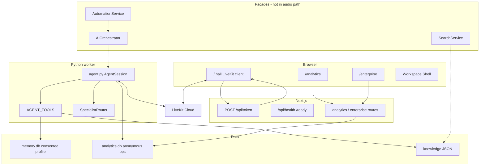

---

## Voice Pipeline

This is the only path that produces sound. No orchestrator, Learning Engine, Search Platform, or Fabric hop.

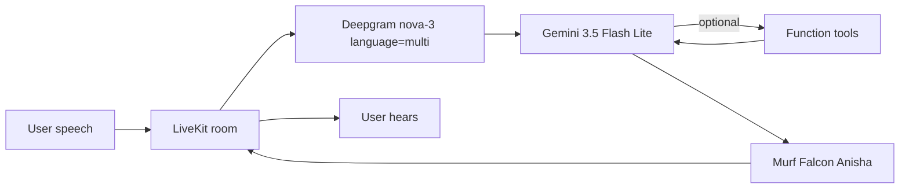

Session knobs in `agent.py`: `max_output_tokens=120`, `thinking_level=minimal`, `text_pacing=False`, endpointing 0.3–1.5s, `preemptive_generation=True`. Silero VAD is prewarmed. There is no custom barge-in API.

---

## Agent flow

Dispatch name is `my-agent`. Math is the only live guest. Other specialists register disabled. One retry, then host.

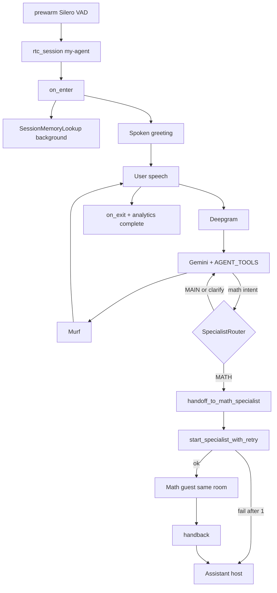

---

## Knowledge flow

Hall retrieval is the JSON tool. Fabric and Memory Graph project the same search. They must not write `memory.db`.

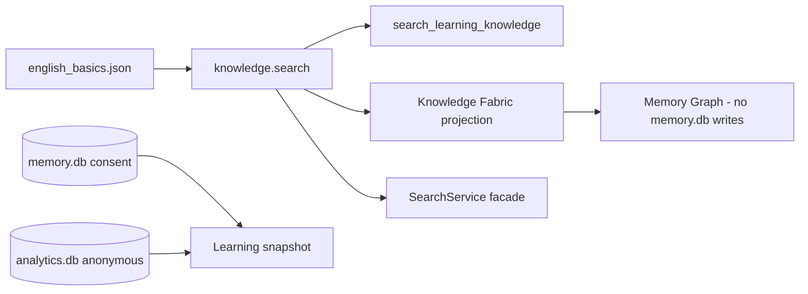

Do not join `memory.db` to `analytics.db` by learner identity.

---

## Search flow

Architected. One `SearchHit` contract. No vector database in Compose. Learners do not get a search box on `/`.

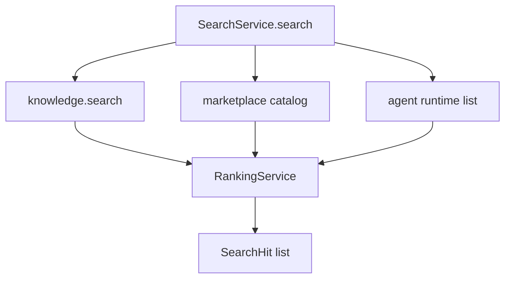

`DiscoveryService` is an alias of the same class. Evidence: `backend/src/services/search.py`, `backend/tests/test_os_v1.py`.

---

## Automation flow

Architected. One engine. `WorkflowAutomationService` is the same class. Jobs are a catalog, not Kafka.

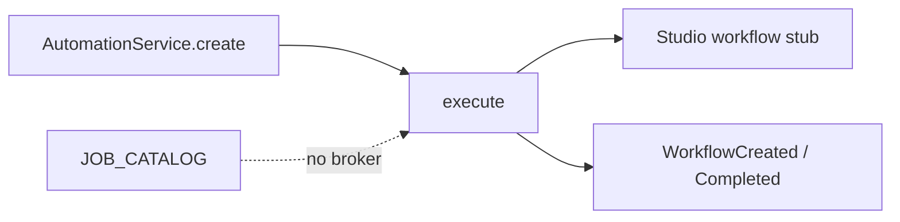

Evidence: `backend/src/services/automation.py`. `may_execute` on marketplace plugins stays false.

---

## Event bus

In-process. History cap 200. No disk, no retry, no broker. Forbidden keys and long forbidden values are dropped.

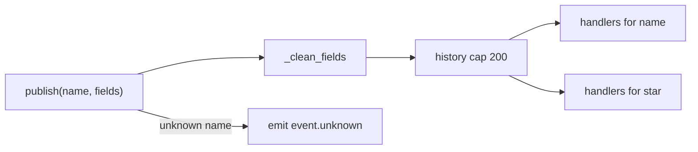

Specialist logging is a separate allow-list logger that drops extra kwargs. It is not a second bus. Evidence: `backend/src/services/events.py`.

---

## Authentication

`AUTH_REQUIRED` defaults **false** so anonymous voice works. Token mint is CSRF-checked and rate-limited. It does not require a logged-in roster.

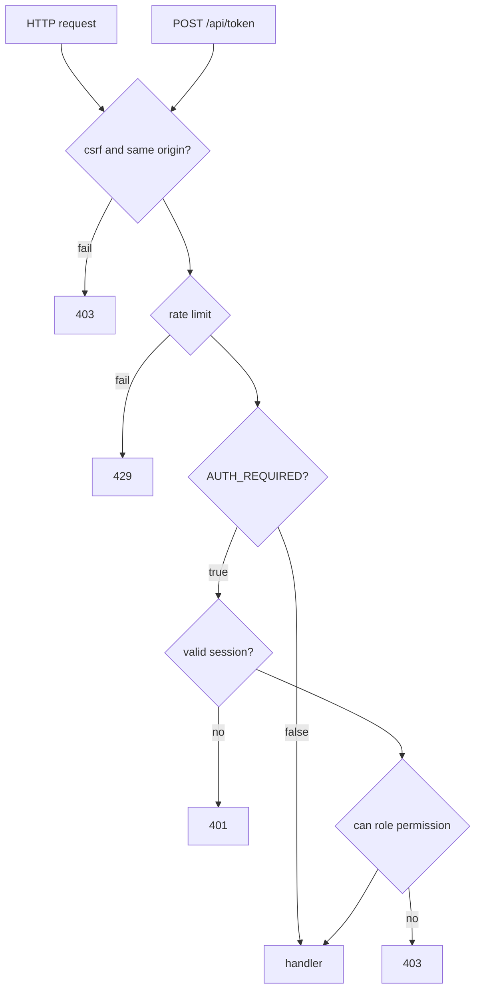

Flip `AUTH_REQUIRED=true` only after identity exists. Documented in [41](../engineering/41_SALORA_OS_V1_RELEASE.md).

---

## RBAC

One function: `can(role, permission)`. Python (`salora_platform.auth`) and TypeScript (`lib/platform/rbac.ts`) share the idea. UI selects are not authority.

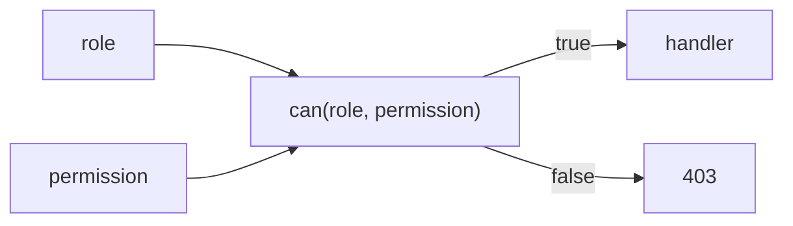

---

## Enterprise isolation

`/enterprise` reads operational aggregates. Tenant records in the later layer are in-memory. Speech columns are forbidden. Profile store and ops store stay unjoined.

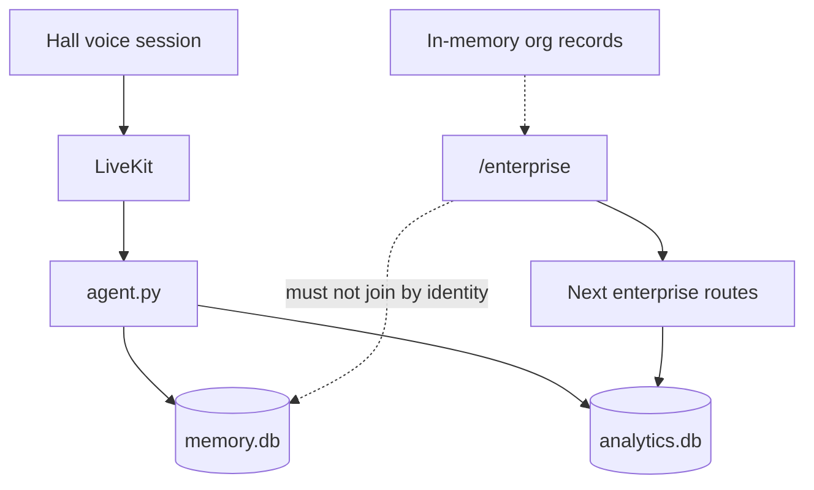

HIPAA checks return `ok: False`. That is a lock, not a missing claim.

---

## Repository structure

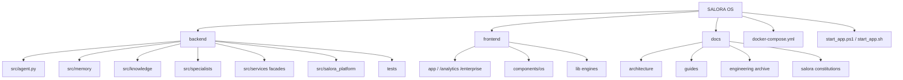
