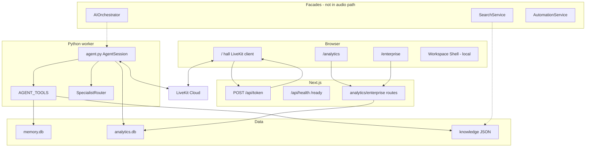
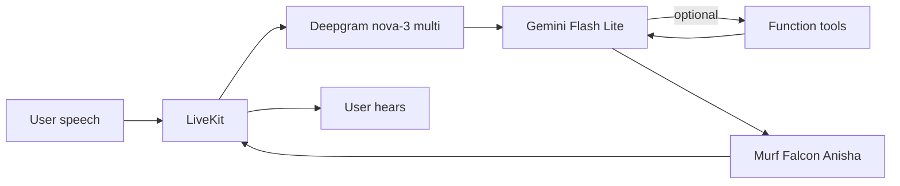
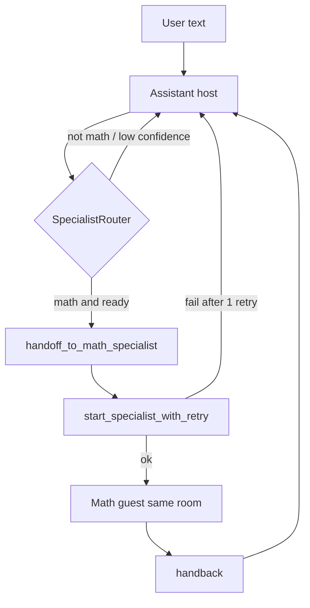
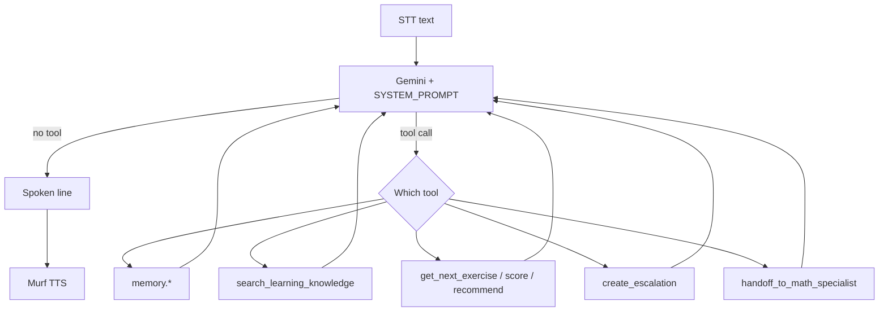
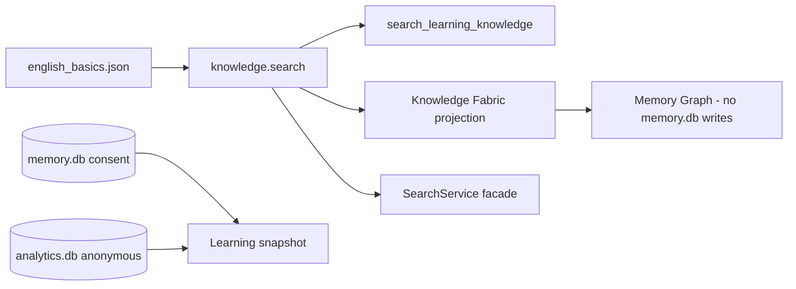
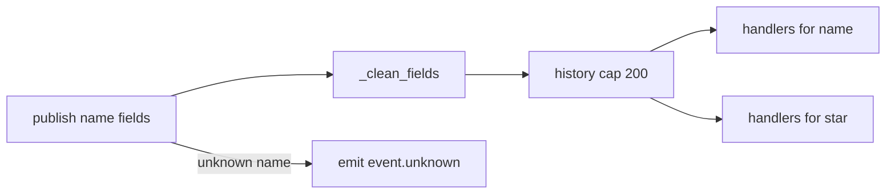
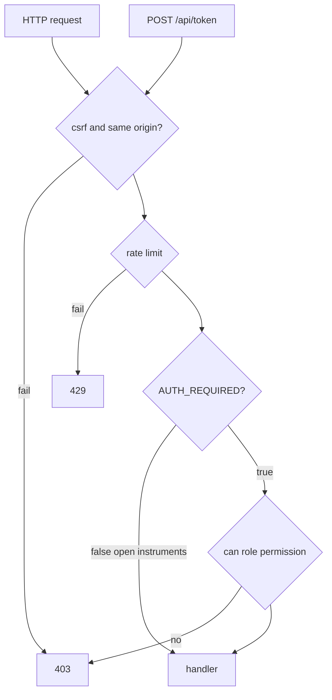
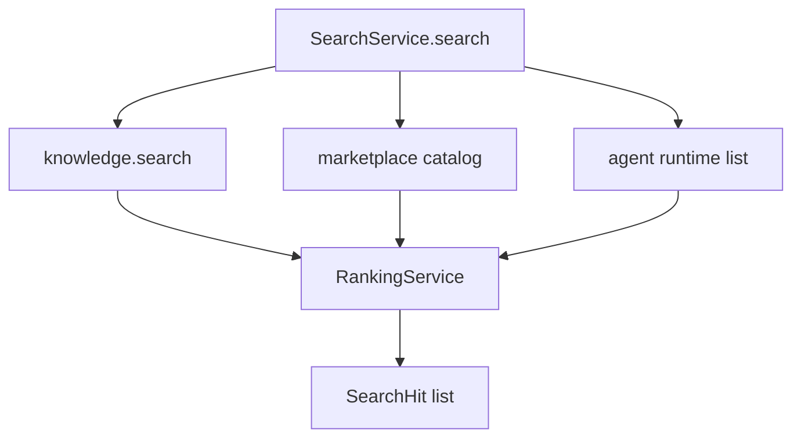
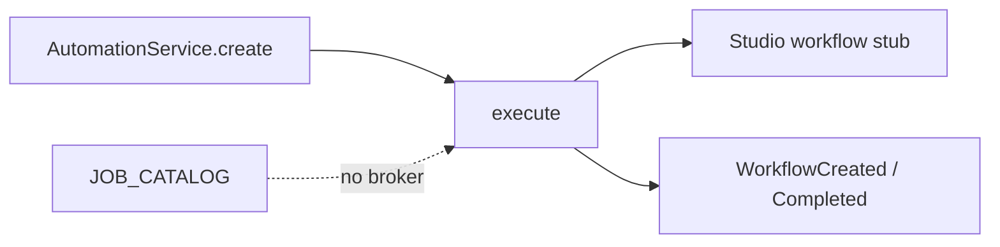

# Day 10 — System architecture and Voice Pipeline (draft)

Architecture chapter for the VoiceForBharat post. Lead-architect notes after the build. Nothing here is a redesign.

**Implemented** — runs on `/` or in `agent.py`.  
**Architected** — module exists; not on the live audio path.  
**Planned** — written; not running (Redis, Kafka, K8s, OTel).

---

## 1. Overall architecture overview

SALORA OS is a monorepo with two processes that meet in LiveKit Cloud.

The browser is a Next.js app. The home route is the hall: a LiveKit client, a wave, session screens. `/analytics` and `/enterprise` are instruments. They call Next routes that wrap existing Python CLIs. They do not carry microphone audio.

The worker is `backend/src/agent.py`. It constructs one `AgentSession`: Deepgram, Gemini, Murf Falcon, Silero VAD, LiveKit turn detector. Tools hang off that session. Specialists visit that session. They do not start a second TTS.

A third idea lives in `backend/src/services/` and `frontend/lib/*`: facades named Orchestrator, Search, Automation, Agent Runtime, Knowledge Fabric. Those packages exist so later rooms do not fork the worker. They are not inserted into `my_agent`. If a slide shows “speech → orchestrator → runtime → fabric → Murf,” that slide is not this repository.

Two files on disk hold durable state: `memory.db` (consented profile) and `analytics.db` (anonymous call ops). Knowledge lessons are JSON. Tenant and plugin stores in the later layer are in-memory.

Evidence: `agent.py`, `frontend/app/page.tsx`, `app/api/token/route.ts`, `docs/architecture/overview.md`, `23_BACKEND_PLATFORM.md`.

---

## 2. System layers

These layers are how I explain the tree. They are not eight running clusters.

| Layer | Responsibility | What actually runs |
| --- | --- | --- |
| Presentation | Hall and instruments | Next.js `/`, `/analytics`, `/enterprise`. Workspace Shell wraps layout (local). Studio/Whiteboard not mounted. |
| Voice | Room + pipeline | LiveKit client; `AgentSession` in `agent.py` |
| Application | HTTP around the hall | `platformRoute`: CSRF, rate limit, optional `can()` |
| Orchestration | Intent facade | `AIOrchestrator` — architected. Specialist routing is `SpecialistRouter` |
| Business services | Domain wrappers | `services/*.py` plus `memory/`, `knowledge/`, `tools/`, `escalation/`, `telephony/`, `analytics/`, `enterprise/` |
| Knowledge | Lessons and projections | JSON `knowledge.search`; Fabric/Graph project it |
| Enterprise | Aggregates and policy | `/enterprise`; `can()`; in-memory orgs |
| Infrastructure | Process and compose | Dockerfiles, compose volume `salora-data`, health modules. No Redis/Kafka in compose |
| Data | Stores | `memory.db`, `analytics.db`, knowledge JSON |

**How a voice turn moves.** Browser captures audio → LiveKit → worker STT → LLM (optional tools) → TTS → LiveKit → speaker. Next.js is not in that hop after the token is minted.

**How an instrument request moves.** Browser → `platformRoute` → permission/rate limit → exec or read → JSON. No Murf.

Evidence: `lib/platform/http.ts`, `salora_platform/`, `docs/architecture/backend.md`.

---

## 3. Voice Pipeline

The real pipeline, from `my_agent` in `agent.py`:

```text
User speech
  → LiveKit room
  → Deepgram STT (nova-3, language=multi)
  → Gemini 3.5 Flash Lite (tools allowed)
  → Murf Falcon TTS (Anisha, text_pacing=False)
  → LiveKit audio track
  → User hears
```

There is no AI Orchestrator hop. There is no Learning Engine hop. There is no Adaptive Engine hop. Those names are facades. Gemini either answers or calls a `@function_tool`.

**Why each stage exists**

- **LiveKit room** — both sides are participants. Token from `POST /api/token`.
- **STT** — ears. `language="multi"` for English/Hindi mix.
- **Gemini** — short spoken lines. `max_output_tokens=120`, `thinking_level=minimal` because 3.x otherwise thinks after tools.
- **Tools** — memory, knowledge, exercises, score, recommend, escalation, math handoff. Not a separate “tool runtime” process.
- **Murf** — only mouth. Same constructor after specialist handoff.
- **VAD + turn detector** — when the user is done. Endpointing 0.3–1.5s. `preemptive_generation=True`.

**State.** `session.userdata` holds learner id and specialist context. `SessionMemoryLookup` caches one SQLite read. ViewController owns screens. `deriveVoiceSnapshot` (local) maps LiveKit agent state to UI phases. Those are two jobs.

**Failure.** Specialist start: one retry, then host (`recovery.py`). Analytics start/complete: isolated. Memory/analytics schema init: log and continue talking. No second TTS if Murf is missing — readiness reports degraded.

**Latency knobs that exist.** Token cap, minimal thinking, no TTS pacing, short endpointing, preemptive generation. No published millisecond figure in the repo.

Evidence: `agent.py` ~461–505, `350–444` (`on_enter` / `on_exit`), `specialists/recovery.py`, `memory/async_lookup.py`.

---

## 4. Agent lifecycle

**Dispatch.** LiveKit job for `my-agent`. `prewarm` loads Silero VAD onto the process.

**Enter.** Resolve `user_id` (participant identity or `anonymous_learner`). Start background memory lookup. Greet. Do not call `lookup_user` every turn.

**Turn.** User speech → STT → Gemini. If the prompt requires a tool, Gemini selects it. Result goes back into the same turn. Murf speaks. Host remains `Assistant` unless math handoff replaces the active agent in-session.

**Route (math only).** Prompt tells the host to announce, then `handoff_to_math_specialist`. `SpecialistRouter.route` returns MAIN, MATH, or stay. Disabled specialists never win. Confidence/clarification live in the router, not in an orchestrator.

**Provider selection.** Not dynamic in the live session. `agent.py` constructs Deepgram, Gemini, Murf. `ProviderRegistry` lists those names and registers others disabled. It does not swap TTS mid-call.

**Capability / permission in audio.** The tutor’s tools are the registered list. Marketplace capabilities do not run. `may_execute` is false. Voice token is issued with publish/subscribe grants; there is no logged-in “voice.session” gate while `AUTH_REQUIRED` is false.

**Leave.** `on_exit` and a shutdown callback touch `last_interaction` and complete analytics if needed.

**Events.** Specialist logger: allow-listed names, kwargs dropped. Platform bus: used by facades, not by the audio callback.

Evidence: `agent.py` `Assistant`, `specialists/router.py`, `specialists/handoff.py`, `services/providers.py`, `test_specialist_*.py`.

---

## 5. Tool calling flow

Implemented as LiveKit function tools on `Assistant`, not as a separate tool server.

```text
User utterance
  → Deepgram
  → Gemini (prompt + tool schemas)
  → optional tool
       memory / knowledge / exercise / score / recommend
       / escalation / handoff
  → tool result (structured, no spoken prose from the tool)
  → Gemini final line
  → Murf
```

**Intent.** For math, deterministic router + prompt rules. For exercises, prompt patterns (“Give me an exercise”). There is no standalone intent microservice.

**Validation.** Exercise payloads go through `validate_exercise_payload` / `ExerciseValidator`. Escalation reasons are allow-listed. Score tool is deterministic. Tools return errors as structures; the prompt says not to dump JSON.

**Selection.** The model picks from `AGENT_TOOLS`. I did not write a second “tool selector” engine.

**Execution.** Tool manager/registry exist for Day 5 internals (metrics, cache). LiveKit still invokes the decorated functions.

Architected-only: Studio “PromptExecuted”, marketplace plugin run. Those must not be described as hall tools.

Evidence: `agent.py` `AGENT_TOOLS`, `tools/livekit_tools.py`, `tools/validator.py`, `escalation/tools.py`, `test_tool_manager.py`.

---

## 6. Knowledge flow

```text
Lesson JSON  --search_knowledge-->  search_learning_knowledge (hall tool)
       \                              \
        \                              SearchService (facade, hybrid + catalog + agents)
         \
          Knowledge Fabric / Memory Graph  (projections, no writes to memory.db)

memory.db  --consent-->  profile fields only
analytics.db  --anonymous-->  call ops, never joined to User
```

Learning Engine snapshots analytics + memory for UI. Adaptive Engine asks the router for advice. Recommendations from `recommend_next_practice` stay in the conversation. Shared specialist context copies level/language/topic, never transcripts.

Evidence: `knowledge/search.py`, `21_KNOWLEDGE_FABRIC.md`, `services/intelligence.py`, `specialists/shared_context.py`.

---

## 7. Event flow

One in-process bus: `services/events.py`.

- `publish(name, **fields)` — unknown names emit `event.unknown`; they still record.
- Fields: drop forbidden keys; drop long string values that match the secret/speech regex.
- `subscribe(name)` and `subscribe("*")`.
- History cap 200. Order is append order in one process.
- No disk. No retry. No consumer ack. No cross-replica fan-out.

Specialist `log_specialist_event` is a second, smaller logger with a fixed message list. Extra kwargs are discarded. It is not a second product bus; it is privacy-safe specialist telemetry.

Kafka / “QueueDeclared” are catalog events. There is no broker.

Evidence: `services/events.py`, `test_ai_services.py` (`test_event_bus_redacts_forbidden_keys_and_long_values`), `specialists/events.py`.

---

## 8. Security architecture

**Secrets.** `.env.local` gitignored. Examples are placeholders. LiveKit keys stay server-side on the token route.

**AuthN.** JWT helper exists (`jose` on the frontend platform lib). `AUTH_REQUIRED` defaults **false**. Anonymous voice is first-class. Instrument routes may open when auth is off.

**AuthZ.** `can(role, permission)` mirrored in Python and TypeScript. UI selects are not authority.

**HTTP.** `platformRoute`: optional CSRF (`assertSameOrigin` on token POST), in-memory rate limits (30/min token, 120/min API by default), metrics.

**Voice grants.** LiveKit token can publish/subscribe. No roster check in the default profile.

**Enterprise.** Policy service on in-memory orgs. Isolation is RBAC, not a row-level tenant database.

**Plugins.** `may_execute` false. Signed catalog ≠ runnable.

**Audit.** `audit()` / structured `emit`. No utterance in traces. Escalation sanitizer redacts OTP/phone-like fields before webhook.

**HIPAA.** `ComplianceCheck` for HIPAA is `ok: False`.

Evidence: `lib/platform/http.ts`, `lib/platform/security.ts`, `salora_platform/auth.py`, `13_SECURITY_STANDARD.md`, `test_platform.py`.

---

## 9. Performance architecture

Verified knobs only.

| Mechanism | Where | What it is not |
| --- | --- | --- |
| Preemptive generation | `AgentSession` | A custom stream server |
| Endpointing 0.3–1.5s | `agent.py` | A measured SLA |
| `text_pacing=False` | Murf TTS | A Falcon benchmark |
| `max_output_tokens=120`, thinking minimal | Gemini | A second LLM |
| Session memory cache | `SessionMemoryLookup` | A Redis cache |
| Exercise request cache + provider cooldown | `tools/request_cache.py`, provider health | A global CDN |
| Process-local rate limits | `lib/platform/security.ts` | Multi-instance limiting |
| Search fan-out in-process | `SearchService` | Incremental vector index |
| `JOB_CATALOG` | `services/jobs.py` | A running queue |
| Compose volume | `salora-data` | HA Postgres |

Lazy dashboard flags exist on education policies as **architected** notes. Do not claim streamed analytics in production.

Evidence: `agent.py` session kwargs, `tools/request_cache.py`, `tools/provider_health.py`, `services/jobs.py`.

---

## 10. Engineering decisions

I kept one Voice Pipeline because a second TTS is a second personality and a second outage. I kept one SpecialistRouter because “adaptive” is advice, not a vote. I kept one pair of SQLite files so ops cannot reconstruct a tape.

Facades (orchestrator, runtime, search, automation, fabric, registry, bus, shell) exist so the next instrument does not copy `agent.py`. They are deliberately thin. Testing the worker still means testing tools and the router, not a mesh of buses.

Extensibility is a new `@function_tool` or a specialist behind the registry — disabled until it is ready. It is not a new pipeline. Planned infrastructure (Redis, Kafka, K8s) is a catalog with `implemented: False`.

Evidence: `01_PRODUCT_BIBLE.md` principles 1–2, 10; `41_SALORA_OS_V1_RELEASE.md`; `services/infrastructure.py`.

---

## 11. Mermaid diagrams

### Overall system



### Voice Pipeline



### Agent runtime / specialist



### Tool calling



### Knowledge



### Event bus



### Security



### Search



### Automation



---

## 12. Architecture verification summary

| Claim | Verdict | Evidence |
| --- | --- | --- |
| One `AgentSession` / one TTS | True | `agent.py` `my_agent` |
| Orchestrator in the voice path | False | No call from `my_agent` |
| Learning/Adaptive generate speech | False | Projections + router advice |
| Search is knowledge JSON + facade | True | `knowledge/search.py`, `services/search.py` |
| Event bus is in-process, no retry | True | `services/events.py` |
| Auth required for voice | False by default | `AUTH_REQUIRED` |
| Plugin execute | Denied | `may_execute` false |
| Redis/Kafka/K8s | Planned catalog | `infrastructure.py` `implemented: False` |
| Custom interruption service | Not found | VAD + turn detector only |

The architecture worth teaching is the thin one: two processes, one room, one mouth, two databases, tools as guests. The named platforms are how we stop ourselves from building a second copy of that.
