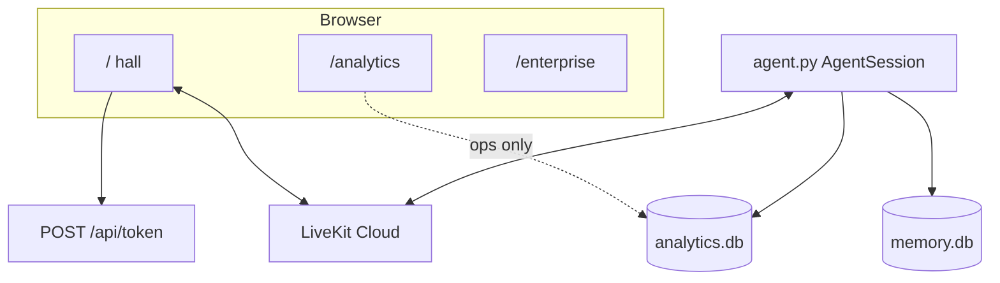

# Building a voice tutor that stays on the line

**SALORA OS** — Day 10, VoiceForBharat Learning & Literacy.  
LiveKit + Murf Falcon + Deepgram + Gemini. One Voice Pipeline.

*Status key: **Implemented** runs in the hall or worker. **Architected** is a facade in the tree, not the audio hop. **Planned** is written in the v1 freeze, not running here.*

---

## 1. Title

**SALORA OS: a voice learning tutor on Murf Falcon, after ten days of refusing a second mouth**

---

## 2. Introduction

I built SALORA OS around a simple loop: a learner opens a browser, speaks, and a tutor speaks back.

That tutor is a LiveKit agent. The page does not stream audio to a custom server of mine. It joins a room. A Python worker named `my-agent` joins the same room. Deepgram turns speech into text. Gemini writes a short reply. Murf Falcon says it. If I added a second text-to-speech path later, I would have two mouths and two personalities. I did not do that.

The product on the home route is an AI Voice Learning Tutor. The chrome says SALORA OS. The spoken identity is still the tutor. You can talk in English, Hindi, or the mix people actually use. Hindi in the reply is written in Devanagari, not default Roman. The first thing the agent does is greet you and ask what you want to practice. It is not a dashboard that happens to have a microphone.

Around that hall I kept two other pages: call analytics, and an enterprise control view. They read operational data. They do not sit in the conversation. They also do not store what you said. Memory, if you allow it, is a small consented profile in one SQLite file. Call stats live in another. Those files are not joined by identity.

I am writing this after ten days on the VoiceForBharat Learning & Literacy track. Days 1–9 are in git. The later operating-system layer — a workspace shell, service facades, search and automation contracts — exists in the tree as architecture. It does not replace the worker. If you only have time to understand one file, read `backend/src/agent.py`.

---

## 3. Problem statement

Most learning software still asks you to type. You read a prompt, you write an answer, you get a paragraph back. That is fine for grammar drills on a desk. It is a poor substitute for speaking.

In practice, people bounce between a video, a notes app, a translator, and a chatbot. None of those stay with you for a turn of actual speech. None of them are required to answer in the same mix you just used. If you speak Hindi at home and English in class, a product that “supports Hindi” by showing a language dropdown is not the same as a tutor that hears *Mujhe English speaking improve karni hai* and answers in kind.

There is also a trust problem. Voice products like to keep tapes. Dashboards like to show transcripts. I did not want a learner’s mouth in a table. The analytics schema has outcomes and timings. It does not have an utterance column. Tests fail the other way.

AI assistance, in this project, is narrow on purpose. The prompt refuses medical, legal, and financial advice, and it will not sit an exam for you. When a learner is stuck and asks for a person, the agent can open a human-help request, but only after it asks. It will not pretend a teacher was notified if the webhook was never configured.

Fragmented tools are how I would have failed this build: one stack for chat, another for voice, a third for “enterprise.” The constraint I kept was the opposite. One room. One voice. Extra capability arrives as a tool or a guest, then leaves.

---

## 4. Why Voice AI

I type all day. I still would not practice spoken English by typing it.

Speech is the skill. A UI that collects text and then “reads it out” is a detour. In the hall, the learner talks, the agent talks, and the wave and status exist so you can see listening versus speaking. Chat input is on (`supportsChatInput: true`). Voice is still the practice.

For India, the multilingual part is not an extra locale pack. Deepgram is set to `language="multi"`. The prompt treats romanized Hindi as Hindi mixing and answers in natural Hinglish when that is what you used. It also insists on Devanagari when the reply is Hindi. Windows consoles default to cp1252; the worker forces UTF-8 so Hindi in the terminal does not die as `?`.

Voice is also how a specialist can visit without becoming a new app. Math hands off inside the same room. The host tells you it is connecting you. When you come back, it does not greet you like a stranger.

I am not going to quote a speedup against typing. I did not publish that measurement. What I did tune, in code, is the spoken turn: short max tokens, minimal Gemini thinking, endpointing between 0.3 and 1.5 seconds, preemptive generation on.

### Why Murf Falcon

Murf Falcon is the text-to-speech engine. It is wired through the LiveKit Murf plugin as `murf.TTS`. The voice is `Anisha`, style `Conversation`. That is the only TTS constructor in the worker.

I kept Falcon when I added memory, tools, telephony, escalation, and a math specialist. A second provider would have been a second personality. The specialist is a guest. It does not bring its own mouth.

Sentence tokenization starts at two sentences. `text_pacing` is off. The comment in `agent.py` is plain: pacing added delay on short tutor replies. I wanted the line to start. I do not have a checked-in benchmark of Falcon against another TTS in this repository, so I will not invent one. Murf’s own product line calls Falcon the fastest TTS API. I used it as the mouth. I did not bake off vendors in CI.

If Murf is down, the session does not grow a backup TTS. Readiness checks look for the Murf key. Fail honestly. Do not swap the voice mid-hall.

---

## 5. Meet SALORA OS

SALORA OS is a monorepo with two processes that meet in LiveKit Cloud.

| Who | What they get today |
| --- | --- |
| Learners | Hall, greeting, practice, score, Forget Me |
| Teachers | Escalation path + aggregates. No `/teacher` page |
| Parents | Named in docs. No `/parent` route |
| Organizations | `/enterprise`. Tenants in the later layer are in-memory |
| Developers | `uv` + `pnpm`, function tools, one router. No portal UI |

**Implemented in the hall:** live conversation, bilingual prompt law, consented memory, knowledge JSON, exercises, math guest, human-help after consent, analytics, enterprise page.

**Architected beside it:** AI Orchestrator, Search Platform, Automation Platform, Knowledge Fabric, Agent Runtime host, Marketplace catalog (`may_execute` false), Studio/Whiteboard models, Workspace Shell.

**Planned (doc 41 only):** identity then `AUTH_REQUIRED=true`, job queue, OTel, plugin signing, mobile/desktop implementations of existing contracts.

HIPAA checks return not-ok. Autonomous loops are denied. Those are locks.

---

## 6. System architecture

The browser is a Next.js app. `/` is the hall. `/analytics` and `/enterprise` are instruments. They call Next routes. They do not carry microphone audio.

The worker is `backend/src/agent.py`. It constructs one `AgentSession`: Deepgram, Gemini, Murf Falcon, Silero VAD, LiveKit turn detector. Tools hang off that session. Specialists visit that session.

A third idea lives in `backend/src/services/` and `frontend/lib/*`: facades named Orchestrator, Search, Automation, Agent Runtime, Knowledge Fabric. Those packages exist so later rooms do not fork the worker. They are not inserted into `my_agent`. If a slide shows “speech → orchestrator → runtime → fabric → Murf,” that slide is not this repository.



Two durable files: `memory.db` (consented profile) and `analytics.db` (anonymous call ops). Knowledge is JSON. Later tenant stores are in-memory.

Full maps: [diagrams.md](../architecture/diagrams.md).

---

## 7. Voice Pipeline

This is the path that actually produces sound:

```text
Microphone
  → LiveKit room
  → Deepgram STT (nova-3, language=multi)
  → Gemini 3.5 Flash Lite
       ↳ may call AGENT_TOOLS
  → Murf Falcon TTS (Anisha, text_pacing=False)
  → LiveKit playback
```

Gemini is the only place tools run in a live turn. The list is memory, knowledge search, exercise, score, recommend, escalation, math handoff. The prompt says: answer first; do not call tools to look busy; never say tool names out loud.

What is **not** in that path: AI Orchestrator, Learning Engine, Adaptive Engine, Search Platform, Knowledge Fabric.

**Lifecycle.** `prewarm` loads Silero. `on_enter` starts a background memory lookup and greets. Turns listen → think → speak. Math may replace the active agent in-session. `on_exit` touches last interaction and completes analytics if needed. Analytics failures are isolated so a dashboard bug does not kill the room. If SQLite init fails, the worker logs and still talks.

**State.** `session.userdata` holds learner id and specialist context. `SessionMemoryLookup` caches one SQLite read. The UI mapper (`deriveVoiceSnapshot`) is a local view of LiveKit + mute. It is not a second engine.

**Latency knobs that exist.** Token cap 120, `thinking_level=minimal`, no TTS pacing, endpointing 0.3–1.5s, `preemptive_generation=True`. No published millisecond figure.

---

## 8. Core features

### Conversation — implemented

Next.js mints a LiveKit JWT. Both sides join one room. Greeting follows `GREETING_INSTRUCTIONS`. Guardrails live in the prompt and in tools (consent, allow-lists, sanitizer).

### Memory — implemented

`lookup_user`, `save_user_memory`, `update_last_interaction`, `forget_user_memory`. Consent must be true before save. Scores are not columns.

### Knowledge and practice — implemented

`search_learning_knowledge` reads JSON. `get_next_exercise` uses local JSON, optional HTTP with fallback and cooldown. `score_spoken_answer` is deterministic. `recommend_next_practice` stays in the conversation.

### Math guest — implemented

Host announces. `SpecialistRouter` is the authority. One retry, then host. Shared context strips transcript keys. Handback does not replay the first greeting.

### Escalation — implemented; notify is partial

Consent, reference ID, urgency without invented emergencies, dedupe. If the webhook is missing, say so.

### Instruments — implemented

`/analytics` and `/enterprise`. No utterance field. CI greps for speech columns.

### Facades — architected

Search fans out to knowledge, catalog, and agent manifests. Automation is one stub engine. Marketplace lists plugins and will not execute them. Studio and Whiteboard have models, not an editor or renderer.

---

## 9. Engineering journey

I started from the Murf LiveKit starter. Day 1 was “does it talk.” Day 2 was “is it a tutor.” Day 3 was “can a person use the hall.” After that, every day added a capability without opening a second mouth.

| Day | What landed |
| --- | --- |
| 1 | LiveKit worker + Murf |
| 2 | Tutor prompt, greeting, Hinglish, guardrails |
| 3 | Session screens, wave, suggestions |
| 4 | Consented SQLite, Forget Me, knowledge tool |
| 5 | Exercises, deterministic score, failover |
| 6 | Outbound telephony as a **separate** path |
| 7 | Human-help after consent |
| 8 | `analytics.db`, `/analytics` |
| 9 | SpecialistRouter, Math guest, `/enterprise` |
| Local | Shell, `salora_platform`, facades, docs, event/DB/compose hardening |

`origin/main` last recorded commit is Day 9. The OS layer is largely the working tree. I will not pretend this was a multi-year calendar. It is a ten-day challenge kernel plus a platform layer grown on top of it.

The rule that survived every day: reuse the working system. Do not rewrite the kernel.

---

## 10. Challenges

**Spoken latency.** Gemini 3.x wanted to think after tools. Murf pacing delayed short tutor lines. I set `thinking_level=minimal`, capped tokens, and turned pacing off. A commented realtime model in `agent.py` stays off. A second TTS was never acceptable. Trade-off: replies stay short. No invented millisecond number.

**Hindi in the mouth and in the log.** Mirror the mix. Hindi → Devanagari. Deepgram `multi`. UTF-8 stdout. The model can still slip. The live LLM judge is skipped in CI.

**Privacy versus a useful dashboard.** One database with a transcript column was the easy design. Rejected. Two files. CI forbids `utterance` / `transcript` columns. You cannot replay what was said. That is the point.

**Specialists without a second pipeline.** Same room. Deterministic router. One retry, then host. Only math is live.

**Tools that chatter.** Prompt law: never say tool names. Lookup once at session start.

**Exercise HTTP failure.** Local JSON fallback, cooldown, cache.

**Escalation that fires too often.** “I’m stuck” is not “get me a teacher.” Consent and allow-lists.

**Auth versus anonymous voice.** `AUTH_REQUIRED` defaults false. Instruments can be open in the demo. Documented, not accidental.

**Event bus leak.** Filters were key-only. Long values could still look like a transcript. Stabilization drops those values. Test added.

**Compose wipe.** Volume `salora-data` → `/app/data`.

I did not take a second STT, a speech lake, or Kafka. Those debates are not in the repo, so I will not narrate them.

---

## 11. Lessons learned

Putting every new day behind `AgentSession` worked. Deterministic scoring worked. Failing toward the host after one retry worked. CI that greps for speech columns worked.

What surprised me: Gemini’s default thinking after tools. Murf pacing hurting short lines. How fast a “helpful” dashboard asks for a transcript. How many platform names you can add before someone draws them into the voice path.

What took longer: bilingual prompt law, escalation honesty, and documentation. Fifty-one numbered files needed a public index before a blog.

If I started again, I would write the two-database law on Day 1, take hall screenshots the week the wave worked, and keep a one-page architecture map from the start. I would not enable a second TTS “just to compare.”

I would still pick LiveKit and Murf. I would still split the two databases. I would still fail toward the host. I would not start with Kafka.

---

## 12. How to run the project

```bash
git clone https://github.com/SAutopsYS/SALORA-OS.git
cd SALORA-OS
cp backend/.env.example backend/.env.local
cp frontend/.env.example frontend/.env.local
```

Fill `LIVEKIT_*` on both sides, plus `MURF_API_KEY`, `DEEPGRAM_API_KEY`, `GOOGLE_API_KEY` on the backend.

```bash
cd backend
uv sync
uv run python src/agent.py download-files
uv run python src/agent.py dev
```

```bash
cd frontend
pnpm install
pnpm dev
```

Open http://localhost:3000. Wait for `agent_name: my-agent`. Allow the microphone. Speak.

Windows: `.\start_app.ps1`. Compose: `docker compose up --build`.

Full verify and debug: [installation.md](../guides/installation.md).

Tests:

```bash
cd backend && uv run python -m pytest -q --ignore=tests/test_agent.py
cd frontend && pnpm exec tsc --noEmit && pnpm lint && pnpm test
```

Last local validation: 434 backend (judge skipped), 25 frontend. Re-run before you quote a number.

---

## 13. Repository walkthrough

```text
backend/src/agent.py      Voice Pipeline
backend/src/memory/       Consented profile
backend/src/knowledge/    JSON lessons
backend/src/tools/        Exercise, score, recommend
backend/src/specialists/  Router, math guest, one retry
backend/src/escalation/   Human-help
backend/src/analytics/    Anonymous ops
backend/src/services/     Facades — not the mouth
frontend/app/page.tsx     Hall
frontend/app/analytics    Instrument
frontend/app/enterprise   Control Center
docs/architecture/        Public map + diagrams
docs/salora/              Constitutions + this post
```

Do not add a second pipeline. [CONTRIBUTING.md](../../CONTRIBUTING.md) says that in one page.

---

## 14. Evidence

| Claim | Evidence |
| --- | --- |
| One TTS | `murf.TTS` in `agent.py`; specialists reuse it |
| STT / LLM | `deepgram.STT(model="nova-3", language="multi")`; `google.LLM` |
| No speech columns | `analytics/repository.py`; CI privacy job |
| Forget Me | `test_forget_user_memory.py` |
| Math retry / handback | `specialists/recovery.py`; `test_specialist_handback.py` |
| Event redact | `services/events.py`; `test_ai_services.py` |
| Days 1–9 | `git log` subjects; [CHANGELOG.md](../../CHANGELOG.md) |
| Facades not in audio | No call from `my_agent` to `AIOrchestrator` |
| Screenshots | **Not in repo.** Capture the current hall. Do not use mocks |

Mermaid: [diagrams.md](../architecture/diagrams.md). Showcase pack: [SALORA_OS_SHOWCASE.md](SALORA_OS_SHOWCASE.md).

---

## 15. Future improvements

Only from [41 SALORA OS v1](../engineering/41_SALORA_OS_V1_RELEASE.md):

1. Identity, then `AUTH_REQUIRED=true`
2. Studio editor / Whiteboard renderer / Graph as instruments (the way analytics already is)
3. Queue behind `JOB_CATALOG`
4. OpenTelemetry exporter
5. Signed plugin crypto
6. Mobile and desktop implementations of **these** contracts

Redis is noted for multi-instance rate limits. Playwright e2e is not in the product suite (`scripts/` has a leftover Playwright install; ignore it). HIPAA is not claimed.

These are future because the hall already talks, and the freeze says consume contracts rather than invent a second kernel. No dates.

---

## 16. Conclusion

I wanted a learner to speak and be answered in the same mix they used, without leaving a tape behind.

The work I am proud of is mostly refusal: no second TTS, no transcript lake, no silent specialist swap, no fake notify, no plugin execute. The work that talks is still `my_agent`.

If you are building a voice agent, keep one session. Put privacy in the schema. Label implemented versus planned before you write the post. Measure latency if you publish a number. I configured knobs. I did not check in a leaderboard.

The line stays open. Guests visit. Dashboards stand to the side.

Repo: https://github.com/SAutopsYS/SALORA-OS
