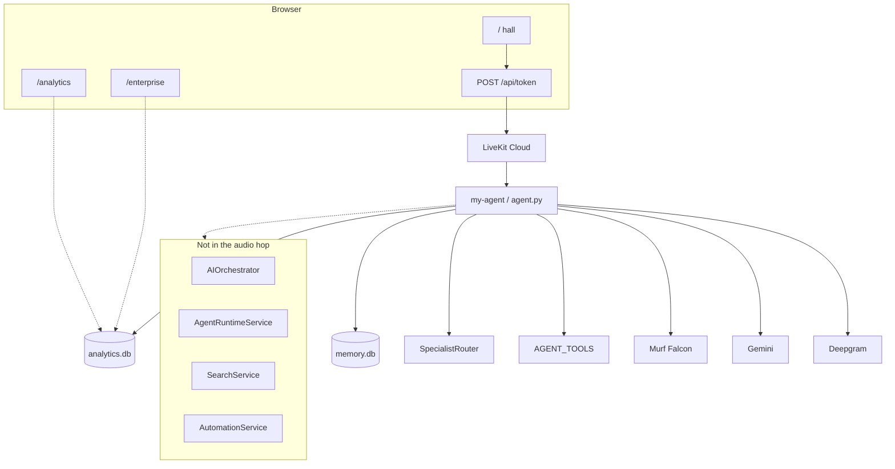
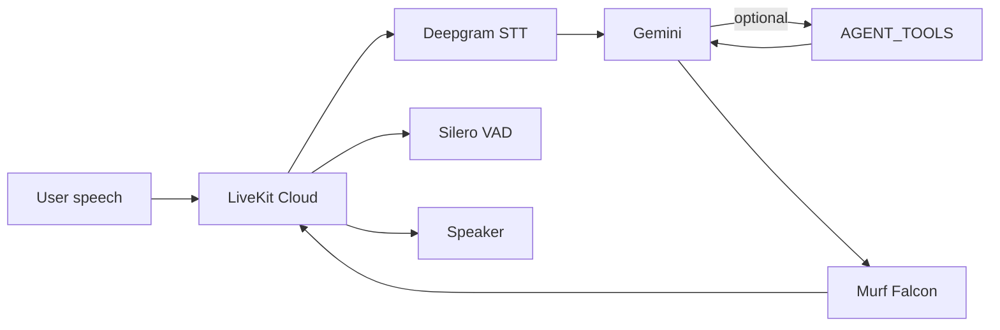
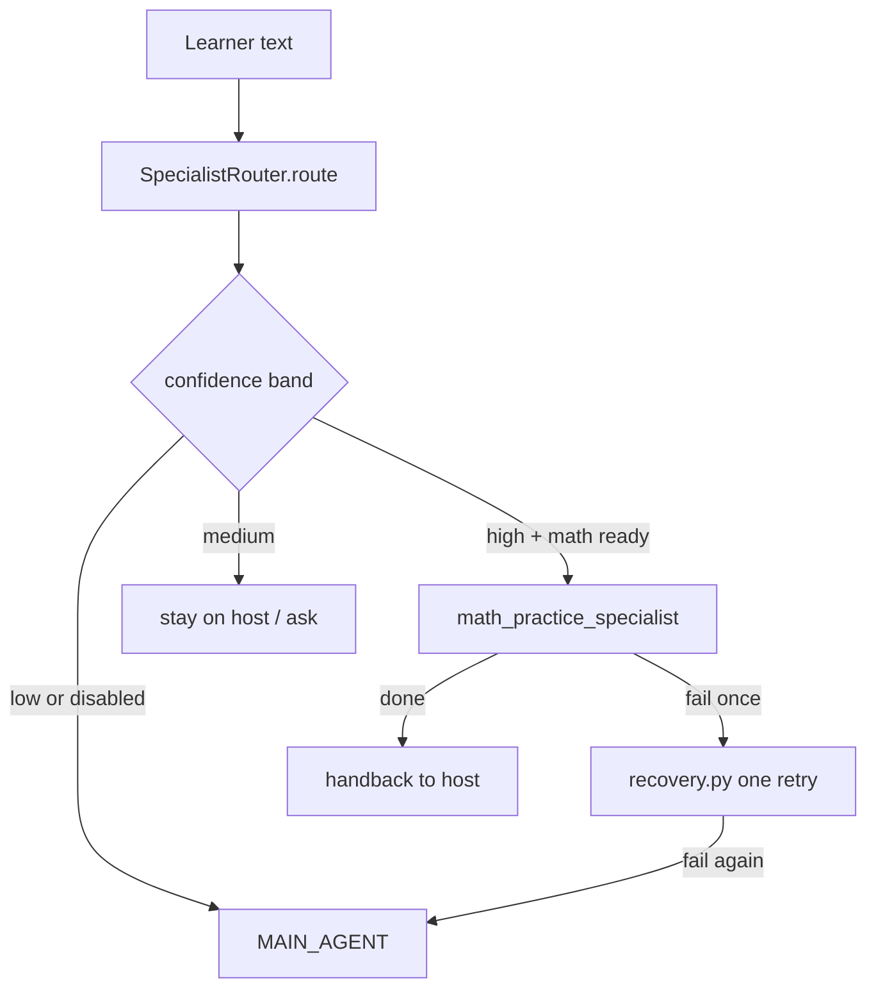
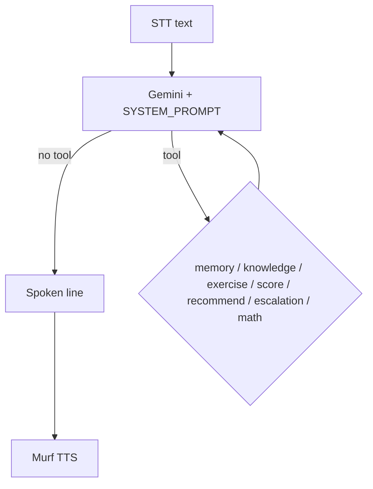
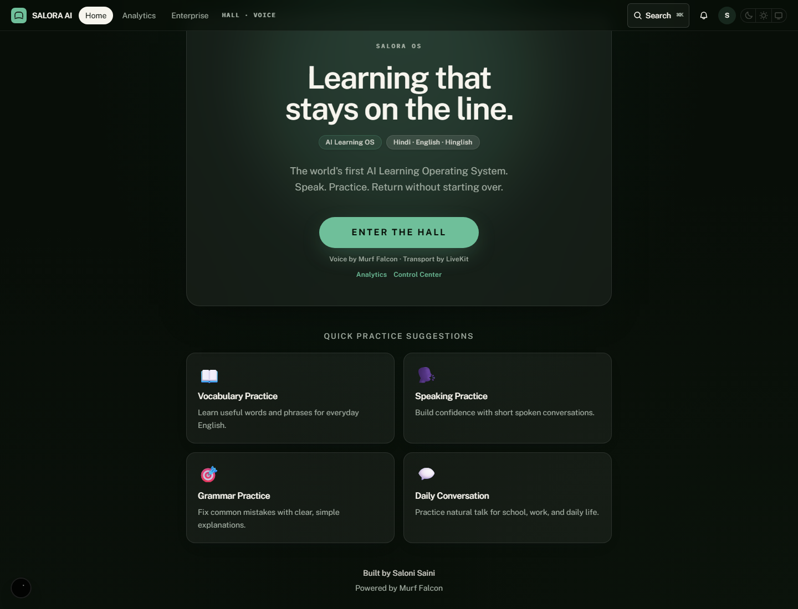
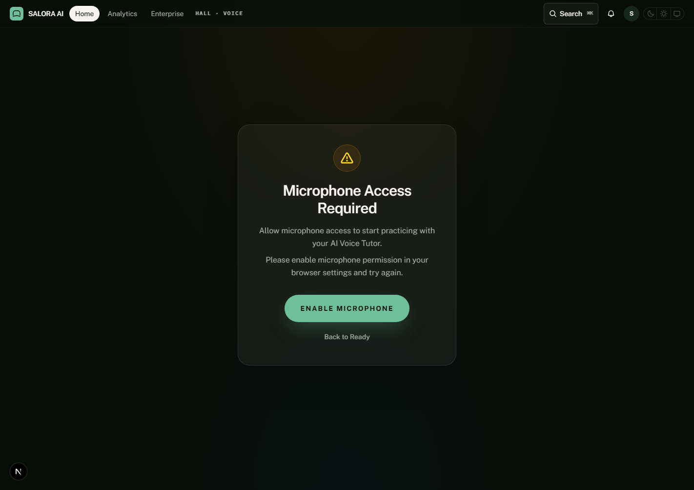
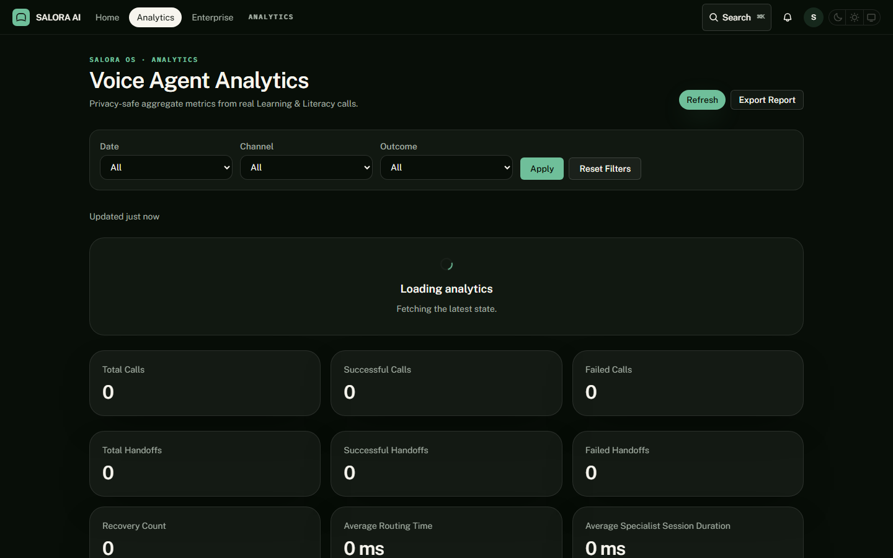
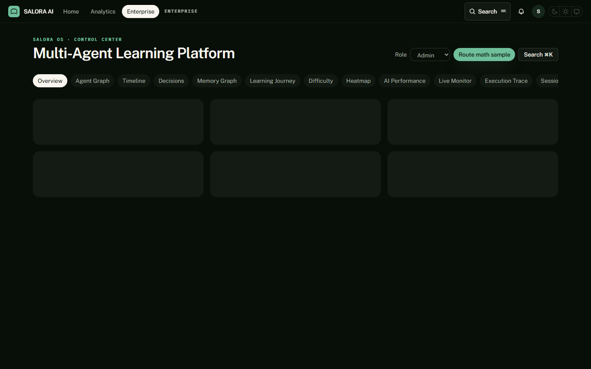

# Building SALORA OS: one LiveKit room, one Murf mouth, and a hard no on a second pipeline

**A voice learning hall on LiveKit and Murf Falcon — what is live, what is a facade, and what I refused to fork.**

---

I started with a mouth, not a platform.

SALORA OS is a voice-first learning product. You open a browser, click **Enter the hall**, allow the microphone, and speak. A Python worker named `my-agent` joins the same LiveKit room. Deepgram turns speech into text. Gemini writes a short reply. Murf Falcon says it.

The chrome says SALORA OS. The spoken identity is still an AI Voice Learning Tutor.

I built it because typing English is not the same skill as speaking it — especially if you mix Hindi and English in one sentence. A language dropdown is not a tutor. A chatbot that answers in a paragraph is not a turn.

The later “operating system” layer — Workspace Shell, orchestrator facade, search and automation contracts — grew around that worker. It does not sit between your microphone and Murf. If a slide shows speech → orchestrator → fabric → Murf, that slide is not this repository.

This work also sits in **10 Days of Voice Agents — VoiceForBharat Edition**. The article is about the product, not a day-by-day diary.

Repo: https://github.com/SAutopsYS/SALORA-OS.git

---

## The problem

Most learning software asks you to type. Voice products, when they exist, like to keep a tape. Dashboards like to show transcripts.

I wanted a hall that stays on the line, answers in the mix you used (Hindi in Devanagari, not default Roman), and never writes an utterance column. Analytics has outcomes and timings. CI greps memory and analytics for `utterance` / `transcript` as columns and fails if they appear.

Specialists, search, and “enterprise” were tempting places to grow a second stack. Extra capability arrives as a LiveKit tool or a guest in the same room, or it stays a facade.

Implemented: the hall loop, tools, math guest, two databases, `/analytics`, `/enterprise`.

Architected: orchestrator, search, automation, fabric, runtime host, Learning / Adaptive projections.

Planned: identity then `AUTH_REQUIRED=true`, job queue, OpenTelemetry, plugin signing.

---

## Who it is for

**Learners** get the hall: greeting, practice chips, exercises, a rule-based score, Forget Me.

**Teachers** get an escalation path after consent, and aggregates. There is no `/teacher` page.

**Parents** are named in product law. There is no `/parent` route.

**Organizations** can open `/enterprise`. Later tenant records are in-memory. Auth is off by default so an anonymous voice session still works. That is a demo choice, not a locked campus.

**Developers** can run `uv` and `pnpm`, add a `@function_tool`, or register another specialist behind the existing router. There is no developer portal UI.

Voice matters here because the skill is speech, and because Hindi/English mixing is how people actually talk. Hands-free is a side effect, not the pitch.

---

## What I built

A browser hall and one LiveKit worker.

The live voice path is:

```text
Microphone → LiveKit room → Deepgram nova-3 (language=multi)
  → Gemini 3.5 Flash Lite (may call AGENT_TOOLS)
  → Murf Falcon Anisha (text_pacing=False)
  → LiveKit → Speaker
```

Around that session, not inside every turn: consent memory, anonymous analytics, a JSON knowledge file, exercise / score / recommend tools, escalation after consent, and one math guest.

`AIOrchestrator` is not on that path. `agent.py` does not import it.

---

## Architecture

Medium does not render Mermaid. Convert these diagrams to images before publish, or keep them as fenced code on GitHub.

Solid lines are the live path. Dashed lines are facades.



The home route is the hall, wrapped in a Workspace Shell (`OsShell` on the layout). You click **Enter the hall**. Next.js mints a LiveKit JWT (`POST /api/token`, CSRF + rate limit). The browser client and the worker join one room. Chat input is on (`supportsChatInput: true`).

If the browser denies the microphone, you get a permission view and a retry. That is a real screen.

---

## Voice pipeline



STT is Deepgram Nova-3 with `language="multi"`. That is how Hindi, English, and mixed turns land in one session.

The LLM is Gemini 3.5 Flash Lite. Knobs in `my_agent`: `max_output_tokens=120`, `thinking_level=minimal`, temperature 0.6. Endpointing is 0.3–1.5s. `preemptive_generation=True`. Silero VAD is prewarmed.

The prompt says: do not stall, do not say tool names out loud, do not call tools to look busy. Keep replies short enough to speak.

**Latency was not benchmarked in this validation run.**

---

## Murf Falcon

VoiceForBharat asked for **the fastest TTS API — Murf Falcon**. That is Murf’s product line. This repo does not contain a bake-off.

What I can point at: `murf.TTS(voice="Anisha", style="Conversation", text_pacing=False)` in `backend/src/agent.py`. The comment in that file is why pacing is off: it delayed short tutor lines. Sentence tokenizer, minimum two sentences.

If Murf is down, I do not swap in a backup TTS. The math guest stays in the same `AgentSession`, so it does not construct a second mouth.

---

## LiveKit

LiveKit Cloud is the room. The frontend and the worker do not stream audio to each other. They both join the room. Token route: CSRF + rate limit. Agent name: `my-agent`.

Reconnect and barge-in are whatever the Agents session and VAD already do. I did not write a custom interruption service.

Telephony is a separate SIP path. It does not replace the browser session.

---

## Agent Runtime

`AgentRuntimeService` hosts the tutor manifest and registered guests. `may_autonomous_loop()` returns false. That is a test, not a TODO.

One runtime is useful because a second host becomes a second personality and a second outage. The live session is still `AgentSession` in `agent.py`. The runtime does not replace it. Treat it as architected, not as the thing that speaks.

---

## Specialist routing

`SpecialistRouter.route` is the only routing authority. Math wins when the intent is math and the guest is ready. Disabled specialists never win. Ambiguous “help me” must clarify.



The host announces the handoff, then `handoff_to_math_specialist` runs. Shared context is read-only and strips transcript keys. Recovery: one retry (`specialists/recovery.py`), then host. Handback does not greet you like a stranger.

Math is the only live guest. Registered but disabled, no factory: English, Science, Reading, Writing, Grammar, Homework, Teacher Assistant, Career, Motivation.

I am not going to invent a sample dialogue. The tests in `test_specialist_handback.py` and `test_specialist_recovery.py` are the evidence.

---

## Tools

Tool calling is implemented. LiveKit `@function_tool` methods on `Assistant`, list `AGENT_TOOLS`.



Memory: `lookup_user`, `save_user_memory`, `update_last_interaction`, `forget_user_memory`. Consent before save. Forget Me deletes the row.

Knowledge: `search_learning_knowledge` over `backend/src/knowledge/resources/english_basics.json`.

Learning tools: `get_next_exercise`, `score_spoken_answer`, `recommend_next_practice`. Scoring is deterministic. Recommendations stay conversation-scoped. Scores are not written to `memory.db`.

Escalation: after consent, allow-listed reasons, sanitizer, dedupe. If the webhook is missing, the agent must not claim a human was pinged.

Math: `handoff_to_math_specialist`.

If scoring fails, the prompt says respond gracefully and do not invent a score.

---

## Memory, learning, and knowledge

`memory.db` holds a consented profile. Scores are not columns. Forget Me deletes the row.

`analytics.db` holds anonymous call ops. Do not join the two files by learner identity.

The system prompt is a Learning Tutor: short, patient, bilingual. It refuses medical, legal, and financial diagnosis, exam cheating, and shaming pronunciation. Hindi replies use Devanagari. Romanized Hindi still counts as mixing.

What is live in the voice turn: the exercise / score / recommend tools, plus the JSON knowledge search.

What is architected: a frontend Learning Engine (`buildLearningIntelligence`) and Adaptive Engine (`buildAdaptiveSnapshot`). Those projections exist, and they have unit tests. `LearningProvider` and `AdaptiveProvider` are not mounted on the hall. Adaptive may advise a specialist. `SpecialistRouter` still decides.

Knowledge Fabric is the same kind of projection. It is not a second database on the audio hop.

---

## Enterprise

`/enterprise` is a real Control Center. The Role selector uses `can(role, permission)`. Later orgs are in-memory. `AUTH_REQUIRED` defaults false so anonymous voice still works.

HIPAA checks return `ok: False`. That is not a certification.

`/analytics` is a real page over `analytics.db`. Speech columns are forbidden.

The Workspace Shell has a command palette (`⌘K`). That is chrome, not a second search product. `SearchService` and `AutomationService` are facades. `DiscoveryService` wraps `SearchService`. `WorkflowAutomationService` is `AutomationService`. No Kafka.

Marketplace is a catalog. `may_execute()` is false.

---

## What was actually hard

**Gemini thinking after tools.** The comment in `agent.py` is the record: Gemini 3.x defaults to deep thinking after tools. Voice dies if the model narrates that. Fix: `thinking_level=minimal` and a 120-token cap. I did not add a second realtime-model session.

**Murf pacing on short lines.** Falcon pacing helps long prose. This tutor answers in one breath. Fix: `text_pacing=False`.

**Privacy vs a useful dashboard.** One database with a transcript column was the easy design. I split the files. CI greps for speech columns.

**Windows standalone build.** `next.config.ts` sets `output: 'standalone'` for Docker. A prior Windows `pnpm build` compiled the app, then failed with `EPERM` on symlinks. That command was not re-run in this publication pass. I did not change the Voice Pipeline to paper over a Windows privilege. CI on Linux is the standalone path.

**Headless screenshots.** The checked-in session shot is a microphone-permission dialog. The capture environment had no microphone. Live listening/speaking screenshot: **CAPTURE REQUIRED**.

**Docs sprawl.** Numbered engineering files reached 51. Easy to describe ten runtimes. The public README is the front door. Facades stay dashed on the diagram.

---

## Testing

Current local run, 15 August 2026:

- Pytest (`--ignore=tests/test_agent.py`): **434 passed** in 19.40s
- Ruff: **All checks passed**
- `tsc --noEmit`: **exit 0**
- Vitest: **25 passed** (17 files)
- ESLint (`next lint`): **exit 0**, starter-kit warnings in agents-ui / ai-elements / opengraph ``

`tests/test_agent.py` is an LLM judge and needs LiveKit. CI skips it. Passing unit tests is not a production certificate. Live soak was not run. `pnpm build` was not re-run in this pass.

---

## Evidence

These files exist in the repository. Inspected for secrets. On Medium, upload the PNGs; the relative paths below work on GitHub.



The hall. **Enter the hall**. Murf and LiveKit credited on the page. The hero copy still says “the world’s first AI Learning Operating System.” That is UI text. I do not repeat it as a claim.



After Enter the hall: **Microphone Access Required**. This proves the permission retry view. It does **not** prove a live listening or speaking turn.

Live listening/speaking screenshot: **CAPTURE REQUIRED**.



Real `/analytics`. Loading spinner plus zeros after a fresh run. No speech column.



Real `/enterprise`. Role dropdown. Empty overview cards on a fresh load.

---

## How to run it

```bash
git clone https://github.com/SAutopsYS/SALORA-OS.git
cd SALORA-OS
cp backend/.env.example backend/.env.local
cp frontend/.env.example frontend/.env.local
```

Fill `LIVEKIT_*` on both sides. Backend also needs `MURF_API_KEY`, `DEEPGRAM_API_KEY`, `GOOGLE_API_KEY`. Do not commit `.env.local`.

```bash
cd backend
uv sync
uv run python src/agent.py download-files
uv run python src/agent.py dev
```

Wait for `agent_name: my-agent`.

```bash
cd frontend
pnpm install
pnpm dev
```

Open http://localhost:3000. Allow the microphone. Speak.

Windows: `.\start_app.ps1`. Compose: `docker compose up --build`.

`.env` and `.env.*` are gitignored except examples. Examples are placeholders. Do not paste live keys into issues, screenshots, or this post. Do not publish a real learner recording. Do not expose LiveKit secrets or Murf credentials.

---

## Troubleshooting

**Worker never registers.** Wrong LiveKit project, or `download-files` was skipped. Match `LIVEKIT_*` on both sides. Wait for `my-agent`.

**Hall loads, no voice.** Worker is down, or the browser denied the mic. Start `agent.py dev`. Use the retry view.

**503 on `/api/ready`.** Missing frontend LiveKit env. Fill `frontend/.env.local`.

**Microphone Access Required.** Browser or headless has no mic. Allow the mic in a real Chrome window.

**`pnpm build` EPERM on Windows.** `output: 'standalone'` needs symlinks. Use CI, Linux, or Docker, or enable Windows Developer Mode.

**Hindi `?` in the terminal.** Windows consoles default to cp1252. The worker already forces UTF-8. That is the console, not a second TTS.

---

## Design decisions

**One Voice Pipeline.** A second TTS is a second personality.

**One SpecialistRouter.** Adaptive may advise. It does not get a second vote in audio.

**One Provider Registry.** It lists names. It does not hot-swap Murf mid-call.

**One Agent Runtime host.** No autonomous loops.

**Two databases, no join.** Privacy is a schema.

**Facades, not forks.** Search and automation exist so I would not copy the worker. They are not in the voice hop.

**Architecture freeze.** Consume contracts. Do not rewrite the kernel. That is [doc 41](../engineering/41_SALORA_OS_V1_RELEASE.md).

---

## Limitations

Anonymous voice is first-class because `AUTH_REQUIRED` is false. That is not campus SSO.

Analytics and enterprise screenshots are empty or loading. They prove the pages exist, not a populated production dashboard.

Learning Engine, Adaptive Engine, Knowledge Fabric, Search, Automation, and Agent Runtime are architected. They are not hops on the live audio path.

Marketplace cannot execute plugins. Studio and Whiteboard have models, not mounted hall rooms.

Telephony needs SIP. Escalation notify is optional and must not lie if the webhook is missing.

Latency was not benchmarked in this validation run.

Live listening/speaking screenshot: **CAPTURE REQUIRED**.

---

## What I would do next

Only from the written roadmap and debt:

- Identity, then `AUTH_REQUIRED=true`
- Queue behind `JOB_CATALOG`
- OpenTelemetry exporter
- Playwright e2e (not in the product suite today)
- A human-captured listening/speaking screenshot
- A latency number **after** I measure one

I would not add a second pipeline to look more complete.

---

## Repository

```text
backend/src/agent.py    Voice Pipeline
frontend/app/           /, /analytics, /enterprise
docs/                   Public map
docs/assets/            Real screenshots
```

Open `agent.py` first. Then `docs/README.md`.

Stack that matters: Next.js 15, LiveKit Agents ~1.4, Murf Falcon, Deepgram Nova-3, Gemini, Silero, uv, pnpm, SQLite, pytest, vitest, Docker Compose.

GitHub: https://github.com/SAutopsYS/SALORA-OS.git

LinkedIn: https://www.linkedin.com/in/saloni-saini-aa7133252/

---

## VoiceForBharat

This work was also prepared for **10 Days of Voice Agents — VoiceForBharat Edition**. TTS: **the fastest TTS API — Murf Falcon**, as Murf describes it. Thanks to [Murf AI](https://murf.ai/). #VoiceForBharat

---

## Conclusion

I wanted a learner to speak and be answered in the same mix they used, without leaving a tape.

The useful work was mostly refusal: no second TTS, no transcript lake, no silent specialist swap, no fake notify, no plugin execute. The line that talks is still `my_agent`.

If you are building a voice agent: keep one session, put privacy in the schema, and write implemented vs planned before you publish. Measure latency if you print a number. I configured knobs. I did not check in a leaderboard.
